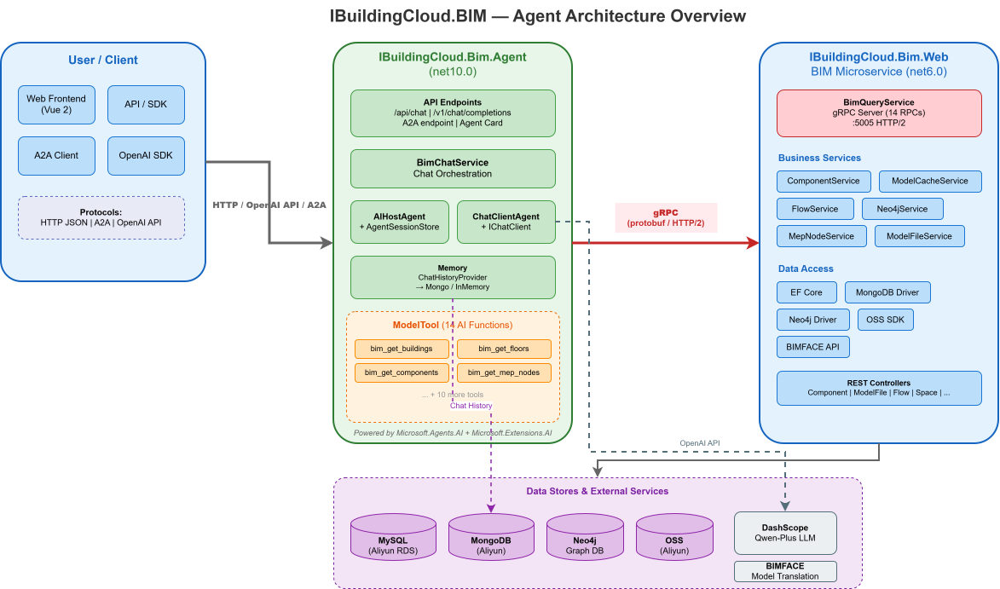

## 背景

最近 AI 领域变化很快，新技术和新概念几乎隔几天就会冒出一轮。刚工作那会儿，一个新框架或新方案往往还能在团队里讨论挺久；现在的大模型圈里，Agent、MCP、Tool Calling 这些名词更新得更快。Agent 这个概念其实出现得更早，我之前也观望过一阵，但一直没有真正动手做。直到后来“小龙虾”这类 Agent 项目爆火，我才更直观地感受到：**以大模型为内核，让程序能够调用工具、完成具体任务，很可能就是接下来软件开发的一个重要方向。**

部门内部已经有一套围绕 BIM 模型数据提取与处理的微服务体系，流程大致是：项目搭建 → 用户配置 → 模型上传 → 设备提取 / 房间提取。整体实现了半自动化，但仍有几个环节离不开开发经验和实施同事的手工操作，比如 Revit 模型配置是否正确、业务规则如何填写、异常数据如何处理等。很多步骤本质上是在做“检查”和“告知”，而不是复杂计算，这部分工作其实很适合交给大模型来完成。

如果这套流程能进一步 Agent 化，后续做数据查询、了解项目进度也会方便很多。部门之前也尝试过一些基于业务数据的智能体应用，比如把 Swagger 文件导入 Dify 快速搭建问答 Agent，或者封装 RESTful API 再单独做一个项目，但整体效果都不算理想。

最近看到微软发布的 <a href="https://learn.microsoft.com/en-us/agent-framework/overview/?pivots=programming-language-csharp" target="_blank" rel="noopener" style="color:#2563eb;font-weight:700;text-decoration:underline">Microsoft Agent Framework</a>，它把 **AutoGen** 和 **Semantic Kernel** 两条路线合并到了一起。Semantic Kernel 更偏企业级 .NET 应用，Plugin、Connector、会话管理和可观测性都比较完整；AutoGen 则更擅长多 Agent 协作和任务编排。Agent Framework 在此基础上又补了 Workflow、Tool Calling、MCP 等能力，目标就是把“实验性的 Agent 玩法”变成能接进现有系统的开发框架。

对我们这种已经有一堆 .NET 微服务的团队来说，这个方向比 Dify 更对口。之前把 Swagger 丢进 Dify 虽然能很快搭出一个问答 Agent，但它和现有业务系统始终是两层皮：工具调用、权限、状态管理、异常处理都要重新适配，实际用起来容易“能聊但不能办事”。而部门这套 BIM 数据处理流程，本质上就是一串可以拆开的步骤——检查 Revit 配置、创建项目、上传模型、触发设备/房间提取、查询任务进度。这些步骤对应的 REST API 其实都已经存在，缺的只是一个能看懂用户意图、按步骤调用工具的 Agent 层。

所以这篇文章想做的事情比较直接：**不另起炉灶，而是在现有微服务之上，用 Microsoft Agent Framework 把它们包装成可调用的 Agent 工具，再对外提供一个统一的智能体入口。**

## 开发流程

以BIM微服务来举例，这个微服务的职能就是刚刚说的模型处理数据处理部门，具体职能就是，上传模型至oss，背景服务生成数据提取任务，revit服务下载模型提取输出上传数据库，同时发起bimface转换任务，提供后台，实施人员可以配置模型的类型，设置项目标高，然后提取设备信息和空间信息，最终集成提供基础的ModelCache，即通用的模型数据，供业务服务查询使用。

我们希望最终得到这样的结构：

```text
User / Client
   |
   | HTTP / OpenAI-compatible API / A2A
   v
IBuildingCloud.Bim.Agent
   |
   | Microsoft.Agents.AI + Tools
   v
BIM Tools
   |
   | gRPC
   v
IBuildingCloud.Bim.Web / BIM Microservice
```

这个结构里，原来的 BIM 微服务仍然负责模型、楼栋、楼层、构件、机电系统等确定性业务能力；Agent 项目负责理解用户意图、选择工具、组织结果，并维护多轮会话上下文，目标是在对原有项目的修改较少的基础上实现智能体的交互，

具体的架构图如下



项目的框架是.net6，微软已经不维护的版本， Microsoft Agent Framework 要求版本是.net8及以上，索性直接用.net10，第一步创建项目，用的是官方推荐的hosting方法，直接创建一个asp.net core web api项目，因为后面也是想把这个智能体暴露出去，作为智能体集群中调用的智能体。

**IBuildingCloud.Bim.Agent**项目就是智能体的入口，

项目创建完成之后添加这几个nuget包：

Agent 项目需要三类包：

第一类是 Agent 框架和模型访问：

```powershell
dotnet add .\IBuildingCloud.Bim.Agent\IBuildingCloud.Bim.Agent.csproj package Microsoft.Agents.AI
dotnet add .\IBuildingCloud.Bim.Agent\IBuildingCloud.Bim.Agent.csproj package Microsoft.Agents.AI.Abstractions
dotnet add .\IBuildingCloud.Bim.Agent\IBuildingCloud.Bim.Agent.csproj package Microsoft.Agents.AI.Hosting
dotnet add .\IBuildingCloud.Bim.Agent\IBuildingCloud.Bim.Agent.csproj package Microsoft.Agents.AI.OpenAI
dotnet add .\IBuildingCloud.Bim.Agent\IBuildingCloud.Bim.Agent.csproj package Microsoft.Extensions.AI.OpenAI
```

第二类是对外暴露 Agent 协议，例如 A2A：

```powershell
dotnet add .\IBuildingCloud.Bim.Agent\IBuildingCloud.Bim.Agent.csproj package Microsoft.Agents.AI.Hosting.A2A
dotnet add .\IBuildingCloud.Bim.Agent\IBuildingCloud.Bim.Agent.csproj package Microsoft.Agents.AI.Hosting.A2A.AspNetCore
dotnet add .\IBuildingCloud.Bim.Agent\IBuildingCloud.Bim.Agent.csproj package Microsoft.Agents.AI.Hosting.OpenAI
```

第三类是和原有 BIM 微服务通信：

```powershell
dotnet add .\IBuildingCloud.Bim.Agent\IBuildingCloud.Bim.Agent.csproj package Grpc.Net.ClientFactory
```

如果需要保存多轮对话历史，可以再引入 MongoDB：

```powershell
dotnet add .\IBuildingCloud.Bim.Agent\IBuildingCloud.Bim.Agent.csproj package MongoDB.Driver
```

Agent 和原有 BIM 微服务之间的通信采用 **gRPC**。团队之前更习惯的做法，是通过 Swagger 生成 C# 客户端，再直接调用 RESTful API。这次改成 gRPC，主要考虑的是内部服务调用场景：接口契约由 `.proto` 文件统一定义，类型更明确；相比 REST + JSON，gRPC 基于 HTTP/2 和 Protobuf 二进制序列化，请求体更小、编解码开销更低，Agent 高频调用后端接口时更省带宽，延迟也更稳定。同时，每个 RPC 方法包装成 Tool 时，参数和返回值也更容易一一对应。

### 生成 gRPC 客户端

BIM 微服务本身已经暴露了 gRPC 接口，Agent 项目只需要引用对应的 `.proto` 文件，并在 `.csproj` 里开启客户端代码生成：

```xaml
<ItemGroup>
  <Protobuf Include="Protos\bim.proto" GrpcServices="Client" />
</ItemGroup>
```

编译后会自动生成对应的 gRPC Client。和 Swagger 生成的 REST Client 相比，gRPC Client 的方法签名、请求体和响应体都是强类型，后续封装 Tool 时 IDE 补全和编译期检查都更完整。

这里还有一个实际问题：原有 BIM 微服务是 **.NET 6**，Agent 项目用的是 **.NET 10**，两边目标框架不一致，不适合直接把 `.proto` 和生成代码重复维护两份。因此单独抽了一个 **.NET Standard 2.0** 项目 **`IBuildingCloud.Bim.Grpc.Shared`**，专门用来放契约层代码。

这个项目本身不处理请求、不转发流量、也不承载业务逻辑，只做一件事：维护 `.proto` 文件，并在编译时生成服务端和客户端都能复用的 C# 类型。

```text
IBuildingCloud.Bim.Grpc.Shared
  - Protos/bim.proto
  - 生成 BimQuery.BimQueryClient
  - 生成 BimQuery.BimQueryBase
  - 生成 PageRequest / GetBuildingsResponse 等消息类型
```

`IBuildingCloud.Bim.Web` 和 `IBuildingCloud.Bim.Agent` 都引用这个 Shared 项目。`.proto` 只维护一份，Client、Service Base 和消息类型也只在 Shared 里生成一次，避免 Agent 和 Web 各自拷贝 proto 后出现接口版本不一致的问题。

运行时调用链路如下：

```text
IBuildingCloud.Bim.Agent
   |
   | gRPC / HTTP2
   v
IBuildingCloud.Bim.Web
```

`Grpc.Shared` 不在运行时链路中间，所以不会多一跳，也不会增加网络开销。它只是编译期依赖，Agent 只负责理解用户意图并调用 Tool，真正的业务处理仍然落在原有 BIM 微服务里。

以下是`proto`示例，目前还仅仅是基于BIM项目的service定义的部分简单功能

```csharp
syntax = "proto3";

option csharp_namespace = "IBuildingCloud.Bim.Grpc.Shared";

package bim;

service BimQuery {
  rpc GetBuildings (PageRequest) returns (GetBuildingsResponse);
  rpc GetFloors (FloorsRequest) returns (GetFloorsResponse);
  rpc GetModelFiles (ModelFilesRequest) returns (GetModelFilesResponse);
  rpc GetModelFileDetail (IdRequest) returns (ModelFileDetailResponse);
  rpc GetActiveModelFiles (ActiveModelFilesRequest) returns (GetActiveModelFilesResponse);
  rpc SearchModelCache (SearchModelCacheRequest) returns (SearchModelCacheResponse);
  rpc GetModelCacheById (ModelCacheByIdRequest) returns (ModelCacheByIdResponse);
  rpc GetMepNodes (MepNodesRequest) returns (GetMepNodesResponse);
  rpc GetMepConnections (MepConnectionsRequest) returns (GetMepConnectionsResponse);
  rpc GetComponents (ComponentsRequest) returns (GetComponentsResponse);
  rpc GetComponentByCode (ComponentByCodeRequest) returns (ComponentDetailResponse);
  rpc GetMepSystemMappings (MepSystemMappingsRequest) returns (GetMepSystemMappingsResponse);
  rpc GetMajors (PageRequest) returns (GetMajorsResponse);
  rpc GetAreas (PageRequest) returns (GetAreasResponse);
}
```

在BIM微服务中，引用`Grpc.Shared`项目，继承BimQueryBase

```csharp
public class BimQueryService : BimQuery.BimQueryBase
{
}
```

实现proto中定义的rpc，以下是获取楼层的方法

```csharp
public override async Task<GetFloorsResponse> GetFloors(FloorsRequest request, ServerCallContext context)
{
    var list = await _floorService.GetMany(
        projectId: request.ProjectId,
        pageNum: request.PageNum, pageSize: request.PageSize,
        keyword: request.Keyword, filter: null, orderStr: "");

    var response = new GetFloorsResponse();
    foreach (var f in list)
        response.Floors.Add(new FloorItem
        {
            Id = f.Id,
            Name = f.Name ?? "",
            Number = f.Number ?? "",
            BuildingId = f.BuildingId,
            BuildingName = f.BuildingName ?? "",
            Elevation = f.Elevation
        });
    return response;
}
```

### 把微服务能力包装成 Agent Tool

Microsoft Agent Framework 里，Tool 本质上就是“Agent 可以调用的函数”。因此改造思路很直接：把 BIM 微服务里已有的业务能力，按 gRPC 方法逐个封装成 Tool。

这里的关键不是重写业务逻辑，而是给现有接口补一层“Agent 能看懂的描述”。`[Description]` 会进入 Tool 的 schema，模型就是靠这些描述来判断什么时候该调用哪个工具、参数该怎么填。

在 Agent 项目中同样引用 `IBuildingCloud.Bim.Grpc.Shared`，然后通过依赖注入拿到 `BimQuery.BimQueryClient`。Tool 类本身不实现业务，只负责把 Agent 传入的参数转成 gRPC 请求，再把返回结果整理成模型更容易理解的 JSON。

```csharp
public class ModelTool
{
    private readonly BimQuery.BimQueryClient _bimClient;

    public ModelTool(BimQuery.BimQueryClient bimClient)
    {
        _bimClient = bimClient;
    }
}
```

定义Tools列表

```csharp
Tools =
  [
      CreateGetBuildingsTool(),
      CreateGetFloorsTool(),
      CreateGetModelFilesTool(),
      CreateGetModelFileDetailTool(),
      CreateGetActiveModelFilesTool(),
      CreateSearchModelCacheTool(),
      CreateGetModelCacheByIdTool(),
      CreateGetMepNodesTool(),
      CreateGetMepConnectionsTool(),
      CreateGetComponentsTool(),
      CreateGetComponentByCodeTool(),
      CreateGetMepSystemMappingsTool(),
      CreateGetMajorsTool(),
      CreateGetAreasTool(),
  ];
```

以刚刚的获取楼层为例：

```csharp
private AITool CreateGetFloorsTool()
{
    return AIFunctionFactory.Create(async (
        [Description("项目ID")] int projectId,
        [Description("模型文件ID，0表示全部")] int fileId = 0,
        [Description("搜索关键词")] string? keyword = null,
        [Description("页码，从0开始")] int pageNum = 0,
        [Description("每页数量")] int pageSize = 20) =>
    {
        var reply = await _bimClient.GetFloorsAsync(new FloorsRequest
        {
            ProjectId = projectId,
            FileId = fileId,
            Keyword = keyword ?? "",
            PageNum = pageNum,
            PageSize = pageSize
        });
        return JsonSerializer.Serialize(reply);
    }, name: "bim_get_floors", description: "获取BIM模型中的楼层列表，可按项目和模型文件筛选");
}
```

记住需要在Program.cs中注入`BimQueryClient`

```csharp
builder.Services.AddGrpcClient<BimQuery.BimQueryClient>(o =>
{
    o.Address = new Uri(builder.Configuration["BimApi:GrpcUrl"] ?? "http://localhost:5003");
}).AddCallCredentials((context, metadata, serviceProvider) =>
{
    return Task.CompletedTask;
}).ConfigureChannel(o => o.UnsafeUseInsecureChannelCallCredentials = true)
.ConfigurePrimaryHttpMessageHandler(() => new SocketsHttpHandler
{
    EnableMultipleHttp2Connections = true
});
```

这样 Web 侧实现的 `GetFloors`，在 Agent 侧就对应一个同名能力的 Tool。服务端逻辑仍然留在 BIM 微服务里，Agent 只负责“什么时候调用、参数怎么传、结果怎么返回给用户”。

### 模型记忆实现

Agent 要能连续对话，就必须能记住同一个用户的前几轮上下文。Microsoft Agent Framework 通过 `AgentSession` 管理会话状态：框架会在 `AgentSession.StateBag` 里保存当前会话的 state，其中就包括用于关联历史记录的 `sessionId`。

官方也提供了基于 OpenAI Responses / Conversation 的实现，可以在发起会话前先创建一个 `conversationId`，后续每次请求带上这个 ID 就能续接上下文。这种方式上手快，但历史默认落在内存里。会话一多、轮次一长，内存占用会明显上升，生产环境里不太合适。

因此这里改用 **`ChatHistoryProvider`** 自定义对话历史存储。它的职责很单纯：

- 每次 Agent 调用前，从外部存储加载历史消息
- 每次 Agent 调用后，把本轮新增消息写回外部存储

Agent 本身不关心消息存在 MongoDB 还是别的数据库，只通过 Provider 读写历史。

#### ChatHistoryProvider

`BimAgentMemoryChatHistoryProvider` 负责把框架会话和实际存储键绑定起来。产品侧传入的 `SessionId`，会通过 `BindSessionDbKey` 写进 `AgentSession` 的 state；后续加载和保存历史时，都用这个 key 去 MongoDB 查数据。

```csharp
public class BimAgentMemoryChatHistoryProvider : ChatHistoryProvider
{
    private readonly ProviderSessionState<SessionState> _sessionState;
    private readonly IChatHistoryStore _store;
    private IReadOnlyList<string>? _stateKeys;

    public BimAgentMemoryChatHistoryProvider(
        IChatHistoryStore store,
        Func<AgentSession?, SessionState>? stateInitializer = null,
        string? stateKey = null)
    {
        _store = store;
        _sessionState = new ProviderSessionState<SessionState>(
            stateInitializer ?? (_ => new SessionState(Guid.NewGuid().ToString("N"))),
            stateKey ?? GetType().Name);
    }

    public override IReadOnlyList<string> StateKeys =>
        _stateKeys ??= [_sessionState.StateKey];

    public string GetSessionDbKey(AgentSession session) =>
        _sessionState.GetOrInitializeState(session).SessionDbKey;

    /// <summary>
    /// 将 Mongo / 内存存储键绑定为产品侧 SessionId（须在首次 Run 前调用）。
    /// </summary>
    public void BindSessionDbKey(AgentSession session, string sessionDbKey)
    {
        ArgumentException.ThrowIfNullOrWhiteSpace(sessionDbKey);
        _sessionState.SaveState(session, new SessionState(sessionDbKey));
    }

    protected override async ValueTask<IEnumerable<ChatMessage>> ProvideChatHistoryAsync(
        InvokingContext context,
        CancellationToken cancellationToken = default)
    {
        var state = _sessionState.GetOrInitializeState(context.Session);
        return await _store.LoadMessagesAsync(state.SessionDbKey, cancellationToken);
    }

    protected override async ValueTask StoreChatHistoryAsync(
        InvokedContext context,
        CancellationToken cancellationToken = default)
    {
        var state = _sessionState.GetOrInitializeState(context.Session);
        _sessionState.SaveState(context.Session, state);

        var newMessages = context.RequestMessages
            .Concat(context.ResponseMessages ?? [])
            .ToList();

        if (newMessages.Count == 0)
            return;

        await _store.SaveMessagesAsync(state.SessionDbKey, newMessages, cancellationToken);
    }

    public sealed class SessionState
    {
        public SessionState(string sessionDbKey)
        {
            SessionDbKey = sessionDbKey ?? throw new ArgumentNullException(nameof(sessionDbKey));
        }

        public string SessionDbKey { get; }
    }
}
```

`ProvideChatHistoryAsync` 负责读，`StoreChatHistoryAsync` 负责写。框架会把当前请求消息和模型回复一并交给 Provider，由 Provider 决定如何持久化。

#### MongoDB 存储

真正落库的逻辑放在 `IChatHistoryStore` 接口后面。这里用 MongoDB 保存 `ChatMessage` 的 JSON 序列化结果，并按 `SessionId` 建索引，方便按会话查询。

```csharp
public class MongoChatHistoryStore : IChatHistoryStore
{
    private const string CollectionName = "ChatHistory";
    private const int DefaultHistoryLimit = 100;

    private static readonly JsonSerializerOptions JsonOptions = new(JsonSerializerDefaults.Web);

    private readonly IMongoCollection<MemoryRecord> _collection;
    private readonly int _historyLimit;

    public MongoChatHistoryStore(IConfiguration configuration)
    {
        var connectionString = configuration["MONGO_URL"] ?? "mongodb://localhost:27017";
        var databaseName = configuration["MONGO_DATABASE"] ?? "BimAgent";
        _historyLimit = configuration.GetValue("ChatHistory:Limit", DefaultHistoryLimit);

        var client = new MongoClient(connectionString);
        var database = client.GetDatabase(databaseName);
        _collection = database.GetCollection<MemoryRecord>(CollectionName);

        _collection.Indexes.CreateOne(
            new CreateIndexModel<MemoryRecord>(
                Builders<MemoryRecord>.IndexKeys.Ascending(r => r.SessionId)));
    }

    public async Task<IReadOnlyList<ChatMessage>> LoadMessagesAsync(
        string sessionId,
        CancellationToken cancellationToken = default)
    {
        var records = await _collection
            .Find(r => r.SessionId == sessionId)
            .SortByDescending(r => r.Timestamp)
            .Limit(_historyLimit)
            .ToListAsync(cancellationToken);

        records.Reverse();

        var messages = new List<ChatMessage>(records.Count);
        foreach (var record in records)
        {
            if (string.IsNullOrEmpty(record.SerializedMessage))
                continue;

            messages.Add(JsonSerializer.Deserialize<ChatMessage>(record.SerializedMessage, JsonOptions)!);
        }

        return messages;
    }

    public async Task SaveMessagesAsync(
        string sessionId,
        IEnumerable<ChatMessage> messages,
        CancellationToken cancellationToken = default)
    {
        var timestamp = DateTimeOffset.UtcNow;
        var writes = new List<WriteModel<MemoryRecord>>();

        foreach (var message in messages)
        {
            var messageId = message.MessageId ?? Guid.NewGuid().ToString("N");
            writes.Add(new ReplaceOneModel<MemoryRecord>(
                Builders<MemoryRecord>.Filter.Eq(r => r.Key, sessionId + messageId),
                new MemoryRecord
                {
                    Key = sessionId + messageId,
                    SessionId = sessionId,
                    Timestamp = timestamp,
                    SerializedMessage = JsonSerializer.Serialize(message, JsonOptions),
                    MessageText = message.Text,
                })
            {
                IsUpsert = true,
            });
        }

        if (writes.Count > 0)
            await _collection.BulkWriteAsync(writes, cancellationToken: cancellationToken);
    }
}
```

在Program.cs中注入

```csharp
builder.Services.AddSingleton<IChatHistoryStore, MongoChatHistoryStore>();
```

读取时会按时间倒序取最近 `_historyLimit` 条，再反转为正序返回给 Agent。这样既保留了多轮上下文，也避免单次加载过多历史消息把 prompt 撑得太大。写入时使用 `BulkWrite + Upsert`，同一条消息重复保存不会产生重复记录。

整体链路可以概括为：

```text
用户 SessionId
  -> BindSessionDbKey
  -> ChatHistoryProvider 读写 MongoDB
  -> Agent 带上历史消息继续对话
```

### 注册 Agent

Tool 和 MongoDB 历史存储准备好之后，在 `Program.cs` 里注册 Agent。这里把系统指令、Tool 列表，以及前面实现的 `BimAgentMemoryChatHistoryProvider` 一并挂到 `ChatClientAgentOptions` 上。

```csharp
var bimAgent = builder.AddAIAgent("bim-agent",
    (sp, name) =>
    {
        var options = new ChatClientAgentOptions
        {
            Name = name,
            ChatOptions = new ChatOptions
            {
                Instructions = agentInstructions,
                Tools = [.. agentTools, .. sp.GetRequiredService<ModelTool>().Tools],
            },
            ChatHistoryProvider = sp.GetRequiredService<BimAgentMemoryChatHistoryProvider>(),
        };

        return new ChatClientAgent(sp.GetRequiredService<IChatClient>(), options);
    },
    ServiceLifetime.Singleton)
    .WithInMemorySessionStore();
```

`.WithInMemorySessionStore()` 这里必须加。Agent Framework 运行时会通过 `AgentSessionStore` 管理 `AgentSession` 实例；如果不注册 SessionStore，后续 `GetOrCreateSessionAsync` 会直接报错。需要注意的一点是：**SessionStore 负责的是运行时 Session 对象，不等于对话历史本身**。真正持久化的多轮消息，仍然由前面的 `ChatHistoryProvider + MongoDB` 负责。

### 对外暴露接口

官方 Hosting 提供了多种发布方式，但和这次的需求并不完全匹配：

- `chat/completions` 默认更接近无状态接口，如果要保留上下文，需要客户端或服务端每次把完整历史传回来
- `responses + conversation` 虽然自带会话能力，但 conversation 默认存在内存里，不适合长时间运行的服务

因此这里没有直接用内置 endpoint，而是自己写了一个 Minimal API，对外兼容 **OpenAI Chat Completions** 格式。客户端除了常规请求体，还需要额外传一个 `X-Session-Id`，用来标识当前会话。

```csharp
app.MapPost("/v1/chat/completions", async (
    HttpContext httpContext,
    OpenAIChatCompletionRequest req,
    BimChatService chat,
    IConfiguration configuration,
    CancellationToken cancellationToken) =>
{
    if (req.Stream)
    {
        return Results.BadRequest(new
        {
            error = new { message = "Streaming chat completions are not supported by this endpoint." }
        });
    }

    if (!httpContext.Request.Headers.TryGetValue("X-Session-Id", out var sessionHeader)
        || string.IsNullOrWhiteSpace(sessionHeader.ToString()))
    {
        return Results.BadRequest(new
        {
            error = new { message = "X-Session-Id header is required." }
        });
    }

    var message = req.Messages
        .LastOrDefault(m => string.Equals(m.Role, "user", StringComparison.OrdinalIgnoreCase))
        ?.GetText();

    if (string.IsNullOrWhiteSpace(message))
    {
        return Results.BadRequest(new
        {
            error = new { message = "A user message is required." }
        });
    }

    var sessionId = sessionHeader.ToString();
    var model = req.Model ?? configuration["OpenAI:ModelId"] ?? "bim-agent";
    var text = await chat.ChatAsync(sessionId, message, cancellationToken);

    return Results.Ok(new
    {
        id = $"chatcmpl-{Guid.NewGuid():N}",
        @object = "chat.completion",
        created = DateTimeOffset.UtcNow.ToUnixTimeSeconds(),
        model,
        choices = new[]
        {
            new
            {
                index = 0,
                message = new
                {
                    role = "assistant",
                    content = text,
                },
                finish_reason = "stop",
            },
        },
    });
});
```

这个接口只处理非流式请求。收到调用后，会从消息列表里取最后一条 user 消息，再结合 `X-Session-Id` 交给 `BimChatService` 处理。

### ChatService 对话入口

`BimChatService.ChatAsync` 是对话链路的核心入口，负责把 HTTP 请求和 Agent 运行时连接起来：

```csharp
public async Task<string> ChatAsync(
    string sessionId,
    string message,
    CancellationToken cancellationToken = default)
{
    ArgumentException.ThrowIfNullOrWhiteSpace(sessionId);
    ArgumentException.ThrowIfNullOrWhiteSpace(message);

    var agent = _serviceProvider.GetRequiredKeyedService<AIAgent>(AgentName);
    var sessionStore = _serviceProvider.GetRequiredKeyedService<AgentSessionStore>(AgentName);
    var historyProvider = _serviceProvider.GetRequiredService<BimAgentMemoryChatHistoryProvider>();

    var hostAgent = new AIHostAgent(agent, sessionStore);
    var session = await hostAgent.GetOrCreateSessionAsync(sessionId, cancellationToken);

    historyProvider.BindSessionDbKey(session, sessionId);

    var response = await hostAgent.RunAsync(
        [new ChatMessage(ChatRole.User, message)],
        session,
        cancellationToken: cancellationToken);

    await hostAgent.SaveSessionAsync(sessionId, session, cancellationToken);

    return response.Text ?? string.Empty;
}
```

一次完整调用大致是这样：

```text
X-Session-Id
  -> GetOrCreateSessionAsync
  -> BindSessionDbKey
  -> ChatHistoryProvider 从 MongoDB 加载历史
  -> Agent 调用 Tool / 生成回复
  -> ChatHistoryProvider 写回 MongoDB
  -> SaveSessionAsync
```

其中 `BindSessionDbKey` 必须在首次 `RunAsync` 前执行，这样 Provider 才知道当前 Session 应该读写哪一组 MongoDB 记录。

## 实施效果
服务端调用：
```python
client = OpenAI(
    api_key="dummy",  # 你的服务如果不校验 OpenAI key，可以随便填；如果有 JWT/鉴权再按你的服务来
    base_url="http://localhost:5223/v1",
    default_headers={
        "X-Session-Id": "user-2-project-1486-thread-abc"
    }
)
```
在header中申明sessionid，即可加载保存对应的记忆

问题1：
```python
resp = client.chat.completions.create(
    model="bim-agent",
    messages=[
        {"role": "user", "content": "你好"}
    ], 
)
```
回答：
```text
你好！我是BIM模型后台的管理助手，可以帮你查询楼宇、楼层、模型文件、构件、机电管网等信息。请告诉我你需要什么帮助？例如：

- 查询某个项目的楼宇列表  
- 查看某栋楼的楼层信息  
- 搜索特定类型的构件（如“空调”、“阀门”）  
- 获取机电管网节点或连接关系  
- 查看模型文件详情或缓存中的构件数据  

只需提供项目ID（如有）和具体需求，我将为你快速获取相关信息。
```
问题2：
```python
resp = client.chat.completions.create(
    model="bim-agent",
    messages=[
        {"role": "user", "content": "1486项目有几层"}
    ], 
)
```
回答：
```text
我来帮你查询项目ID为1486的楼层信息。首先需要获取该项目的楼层列表。


根据查询结果，项目ID为1486的BIM模型中包含**9层**，具体如下（均属于"2号楼"）：

- 2号楼地下2层（2#B2F）
- 2号楼地下1层（2#B1F）
- 2号楼1层（2#1F）
- 2号楼2层（2#2F）
- 2号楼3层（2#3F）
- 2号楼4层（2#4F）
- 2号楼5层（2#5F）
- 2号楼6层（2#6F）
- 2号楼屋面（RF）
```
问题3：
```python
resp = client.chat.completions.create(
    model="bim-agent",
    messages=[
        {"role": "user", "content": "我刚刚问了啥问题"}
    ], 
)

```
回答：
```text
你刚刚问的是：“1486项目有几层”。
```

## 后续开发

当前这版 BIM Agent 已经能完成基础问答、楼层查询和多轮会话记忆，但离“真正可交付的业务助手”还有一段距离。后面准备按几个方向继续补：

### Context 上下文增强

现在的记忆主要是“聊天记录”，还缺少项目级、任务级的业务上下文。后续会把项目 ID、模型文件、当前处理阶段、Revit 配置检查结果等信息，作为 Context 注入 Agent，而不是每次都让用户重复说明。比如用户问“这个模型提取完成了吗”，Agent 应该能结合当前会话绑定的项目和文件上下文直接回答，而不是反问他指的是哪个项目。

这部分可能会拆成两类：

- **会话上下文**：当前项目、当前模型、最近调用的 Tool 结果
- **知识上下文**：Revit 配置规范、常见报错处理方式、实施操作说明

如果某些规则文档比较长，后面也会考虑接 RAG，把静态知识从 prompt 里拆出去。

### Skill 能力封装

现在 Tool 还是按 gRPC 方法逐个暴露，后续会按业务场景整理成 Skill。比如“项目初始化”“模型上传与检查”“设备提取”“空间提取”“进度查询”分别对应一组 Tool 和一段使用说明。这样对模型来说，不是面对一堆零散接口，而是先选 Skill，再在 Skill 内调用具体 Tool，调用成功率会更高。

Skill 也可以按角色拆分。实施同学生成项目、上传模型时，和开发同学排查提取异常时，需要的工具集本来就不一样，后面可以在 Agent 入口按角色加载不同 Skill 包。

### 通用 Tool

BIM Agent 不能只会查内部数据。后面还计划补一些通用 Tool，例如：

- **WebSearch**：查规范、查厂商文档、查外部资料
- **文档解析**：读取 PDF、Word、Excel 中的实施说明
- **通知推送**：提取失败或任务完成时，把结果发到 IM 或邮件

这些 Tool 和业务 Tool 分开维护，所有 Agent 都可以复用，避免每个微服务 Agent 都重复实现一遍。

### 智能体集群

部门内部不只有 BIM 微服务，后面还会有数据管道、数字孪生、运维平台等不同方向的 Agent。单个 Agent 很难覆盖全部能力，更适合拆成多个专业 Agent，再通过 A2A 或统一网关做编排。

初步设想是这样：

```text
统一入口 Agent
  -> 识别用户意图
  -> 路由到 BIM Agent / DataPipeline Agent / DigitalTwin Agent
  -> 汇总多个 Agent 的 Tool 调用结果
  -> 返回给用户
```

BIM Agent 负责模型和数据处理，DataPipeline Agent 负责数据源和指标查询，DigitalTwin Agent 负责三维场景和设备状态。入口 Agent 只做任务分发和结果整合，不把全部 Tool 堆在一个 Agent 里。

当前这版更像第一个可运行原型：验证了“.NET 微服务 + gRPC Tool + MongoDB 会话记忆”这条路能走通。后面会继续往 Context、Skill、通用 Tool 和 Agent 集群几个方向补，让它从“能查楼层”逐步变成“能辅助完成一整条 BIM 数据处理流程”。

