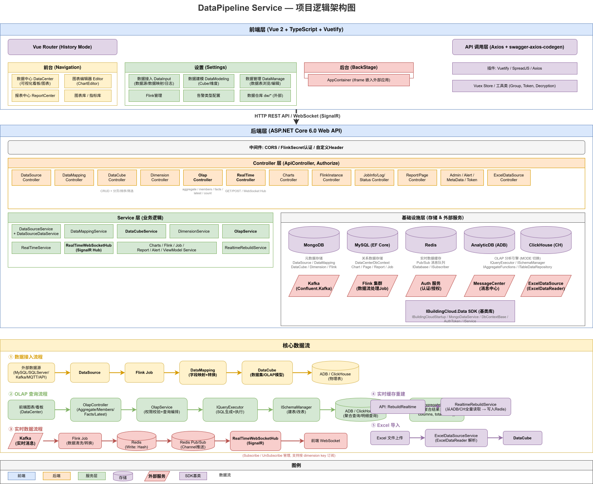
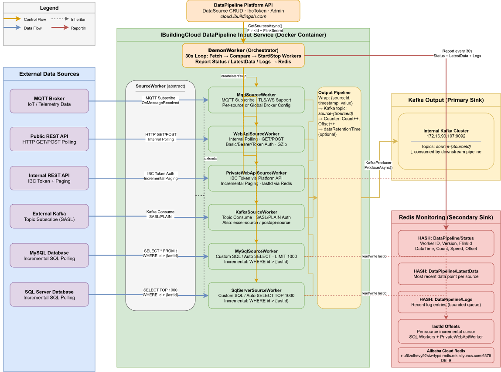
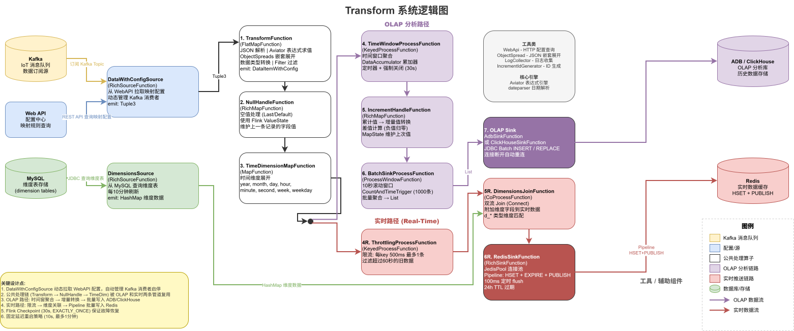

## 项目背景

智慧建筑项目里，业务数据往往散落在不同系统中：设备通过 MQTT 上报遥测数据，第三方平台提供 REST API，内部系统通过 Kafka 传递事件，历史业务数据沉淀在 MySQL 或 SQL Server 中。如果每一种数据源都单独写一套采集程序，后续维护、扩展和排查问题都会非常困难。

这个 DataPipeline 项目的目标，就是把这些异构数据统一纳入一条可配置的数据链路中：**Input 负责接入数据并写入 Kafka，Transform 基于 Apache Flink 做 ETL 和实时计算，DataPipeline Service 提供前后端配置、建模、查询和可视化能力。**

整体链路可以概括为：

```text
多源数据
  -> DataPipeline Input
  -> Kafka Topic
  -> DataPipeline Transform(Flink)
  -> ClickHouse / ADB / Redis
  -> DataPipeline Service
  -> OLAP 查询 / 实时看板 / 可视化应用
```

## 总体架构

平台整体分成三部分：

**DataPipeline Input** 是数据接入层。它是一个基于 .NET 6 Worker Service 的采集服务，支持 MQTT、REST API、私有 API、Kafka、MySQL、SQL Server 等多类数据源。用户在平台上配置数据源后，Input 服务会动态拉取配置，启动对应 Worker，将采集到的数据统一封装后写入 Kafka。

**DataPipeline Transform** 是数据处理层。它基于 Apache Flink 构建，消费 Input 写入的 Kafka Topic，根据平台配置的数据映射关系进行字段抽取、表达式计算、空值处理、时间维度展开、窗口聚合、累计转增量和维度关联，最后分别写入 OLAP 引擎和 Redis。

**DataPipeline Service** 是平台服务层。它是一个 .NET 6 + Vue 2 的前后端应用，负责数据接入配置、维度表定义、事实表建模、数据映射、Flink 任务管理、OLAP 查询和实时数据可视化。



## Input：多源数据接入

Input 服务解决的是“数据从哪里来”的问题。它不直接关心后续如何建模和分析，而是把不同来源的数据统一采集进 Kafka，给下游 Flink 任务提供稳定的数据入口。



### 动态 Worker 调度

Input 内部把每一种数据源抽象成一个 Worker，所有 Worker 都继承自统一的 `SourceWorker` 基类。调度器会定时从平台 API 拉取数据源配置，根据数据源类型创建对应 Worker。

```csharp
public static SourceWorker? Make(DataSource source, IServiceProvider services)
{
    SourceWorker? worker = source.Type switch
    {
        "mqtt-source" => services.GetService<MqttSourceWorker>(),
        "mysql-source" => services.GetService<MySqlSourceWorker>(),
        "sqlserver-source" => services.GetService<SqlServerSourceWorker>(),
        "restapi-source" => services.GetService<WebApiSourceWorker>(),
        "privateapi-source" => services.GetService<PrivateWebApiSourceWorker>(),
        "kafka-source" => services.GetService<KafkaSourceWorker>(),
        _ => null
    };

    if (worker != null) worker._source = source;
    return worker;
}
```

这种设计的好处是扩展成本很低。后面如果要支持 PostgreSQL、MongoDB 或 gRPC，只需要新增一个 Worker 子类，并在工厂方法里增加一个类型分支，不需要改动整体调度框架。

调度器 `DemonWorker` 会每 30 秒拉取一次平台配置，并用 `(sourceId, version)` 作为 Worker 的唯一标识。配置没有变化时，Worker 会继续运行；配置版本变化后，旧 Worker 会被停止，新 Worker 按新配置启动。

```text
平台配置变更
  -> DataSource.Version 增加
  -> DemonWorker 发现版本不一致
  -> 停止旧 Worker
  -> 创建新 Worker
  -> 继续采集并写入 Kafka
```

这相当于一个轻量的调和循环，可以实现数据源配置的热更新。

调度器的核心逻辑并不复杂，本质上就是不断对比“平台期望运行的数据源”和“当前进程里实际运行的 Worker”。如果某个数据源被删除、停用或版本变化，就停止旧 Worker；如果平台新增了数据源配置，就创建新的 Worker。

```csharp
protected override async Task ExecuteAsync(CancellationToken stoppingToken)
{
    while (!stoppingToken.IsCancellationRequested)
    {
        dataSources = await dataSourceController.GetSourcesAsync(...);

        foreach (var worker in workers)
        {
            if (dataSources.Any(x => worker.Key == (x.Id, x.Version))) continue;

            await worker.Value!.StopAsync(new CancellationTokenSource(5000).Token);
            workers.Remove(worker.Key);
        }

        foreach (var dataSource in dataSources)
        {
            if (workers.ContainsKey((dataSource.Id, dataSource.Version))) continue;

            var worker = SourceWorker.Make(dataSource, _services);
            if (worker == null) continue;

            workers.Add((dataSource.Id, dataSource.Version), worker);
            await worker.StartAsync(new CancellationToken());
        }

        await ReportStatus();
        await ReportLatestData();
        await ReportLogs();

        await Task.Delay(30000, stoppingToken);
    }
}
```

这里用 `(Id, Version)` 做 key 是比较关键的设计。如果只用 `Id`，配置变化后 Worker 很难判断自己是否应该重启；加入 `Version` 后，配置更新会天然表现成一个“旧 Worker 消失、新 Worker 出现”的过程，调度逻辑就变得很直接。

### 统一输出到 Kafka

无论数据来自 MQTT、API、数据库还是 Kafka，最终都会通过 `SourceWorker.Output()` 写入统一格式的数据包。

```csharp
protected async Task Output(JsonElement payload)
{
    var json = JsonSerializer.Serialize(new
    {
        sourceId = _source.Id,
        timestamp = DateTimeOffset.Now.ToUnixTimeMilliseconds(),
        value = payload
    });

    var message = new Message<string?, string> { Key = null, Value = json };
    var result = await kafkaProducer.ProduceAsync($"source-{Source.Id}", message);

    latestData = json;
    Count++;
    Offset = result.Offset.Value;
}
```

这里做了几个关键约定：

- 每条数据都有统一信封：`sourceId`、`timestamp`、`value`。
- 每个数据源写入独立 Kafka Topic：`source-{SourceId}`。
- Worker 会记录最新数据、累计条数、Offset 和最后采集时间，用于平台侧监控。

另外，数据源配置里还可以带 `dataRetentionTime`，Input 会根据这个配置调整 Kafka Topic 的保留时间。这样不同业务可以配置不同的数据暂存周期：实时设备状态可能只需要保留一天，业务流水或补数数据则可以保留更久。

### 增量采集与断点续传

对数据库和分页 API 来说，全量轮询成本太高，因此 Input 对这类数据源做了增量采集。MySQL、SQL Server 和私有 API Worker 会把最新处理到的 `lastId` 写入 Redis，服务重启后可以从断点继续读取。

```text
读取 Redis lastId
  -> 查询 id > lastId 的数据
  -> 逐条写入 Kafka
  -> 更新 lastId
  -> 写回 Redis
```

Redis Key 中包含数据源版本，例如：

```text
DataPipeline/MySqlSource/{SourceId}-{Version}-LastId
```

这样当数据源配置升级后，旧断点会自然失效，避免字段结构变化后仍从旧位置继续读导致数据异常。

数据库 Worker 的核心循环大致如下：启动时先从 Redis 恢复断点，然后按 `id > lastId` 查询数据；如果本轮查询到了新数据，就立刻继续下一轮，直到没有积压数据时才按配置间隔等待。

```csharp
protected override async Task ExecuteAsync(CancellationToken stoppingToken)
{
    var redisKey = $"DataPipeline/MySqlSource/{Source.Id}-{Source.Version}-LastId";

    if (UseLastId)
    {
        var redisValue = await redis.StringGetAsync(redisKey);
        if (redisValue.HasValue) lastId = int.Parse(redisValue!);
    }

    while (!stoppingToken.IsCancellationRequested)
    {
        var sql = GetSql(lastId);
        await using var reader = await command.ExecuteReaderAsync(stoppingToken);

        while (await reader.ReadAsync(stoppingToken))
        {
            var id = Convert.ToInt32(reader["id"]);
            if (id > lastId)
            {
                lastId = id;
                hasNewData = true;
            }

            await Output(JsonSerializer.SerializeToElement(json));
        }

        if (!hasNewData)
        {
            await Task.Delay(TimeSpan.FromMilliseconds(interval), stoppingToken);
        }

        if (UseLastId) await redis.StringSetAsync(redisKey, lastId);
    }
}
```

REST API 场景也有类似机制。分页接口会按 `pageNum` 和 `pageSize` 向后读取，遇到小于等于 `lastId` 的数据直接跳过，只输出新增数据。这样即使第三方接口不支持标准 CDC，也能通过“分页 + id 断点”的方式实现准实时增量接入。

### Token 与认证处理

很多第三方 REST API 都需要先请求 Token，再带 Token 请求业务接口。Input 的 `WebApiSourceWorker` 里做了 Token 缓存和自动刷新：正常情况下复用缓存 Token；如果接口返回 401 或 403，就清空缓存，下一轮重新获取。

```text
请求业务 API
  -> Token 有效：正常采集
  -> Token 失效：清空缓存
  -> 下一轮重新请求 Token
  -> 继续采集数据
```

这个细节对长期运行的采集服务很重要，否则 Token 过期后 Worker 就会一直失败，只能靠人工重启恢复。

### 水平扩展

Input 支持多实例部署。每个实例通过 `FLINK_ID` 标识自己，平台可以把不同数据源分配给不同节点。默认节点还可以接收没有显式分配的 DataSource。

```text
FLINK_ID=node-1 -> 只拉取 FlinkId == "node-1" 的数据源
IS_DEFAULT=true -> 同时拉取 FlinkId 为空的数据源
```

这种方式虽然简单，但足够满足按数据源粒度做负载均衡的需求。某些高频数据源可以单独分配到独立节点，低频数据源则由默认节点统一处理。

### 状态监控

Input 服务会把 Worker 的运行状态写入 Redis，包括采集速度、最新数据、日志和 Offset。平台页面可以直接读取这些状态，让用户看到每个数据源是否在线、最近是否有数据、采集速度是否异常。

## Transform：基于 Flink 的 ETL 与实时计算

Transform 负责“数据如何被清洗和加工”。它消费 Input 写入的 Kafka 数据，根据用户在平台上配置的数据映射关系，把原始 JSON 转换成可分析、可展示的结构化数据。



Transform 的核心是一个 Flink Job，它内部有两条输出路径：

```text
Kafka 原始数据
  -> 公共处理链
    -> OLAP 路径：窗口聚合 / 累计转增量 / 批量写入 ClickHouse 或 ADB
    -> 实时路径：限流 / 维度关联 / 写入 Redis / 推送前端
```

入口代码上，OLAP 管道和实时管道运行在同一个 Flink Job 里，共享前面的清洗逻辑，但输出目标不同。

```java
olapPipeline(env);
realTimePipeline(env);
env.execute("TransformAndSink" + flinkId);
```

### 公共处理链

无论是历史分析还是实时看板，数据都会先经过三步公共处理。

第一步是 `TransformFunction`，负责 JSON 展开、字段映射、表达式计算和类型转换。很多 IoT 数据会把多个设备点位放在一个嵌套 JSON 里，Transform 会根据配置把对象或数组拆成多条记录。

```json
{
  "gatewayId": "GW001",
  "timestamp": 1715875200,
  "indoorUnits": [
    { "unitId": "U1", "temp": 26.5 },
    { "unitId": "U2", "temp": 24.0 }
  ]
}
```

映射时支持 Aviator 表达式，因此字段不只是重命名，也可以做计算。例如温度换算、状态码转换、多个字段拼接等，都可以通过表达式在配置层完成。

嵌套对象展开依赖一个约定：`$` 用于按路径取值，`#` 用于遍历对象或数组。比如 `indoorUnits.#.unitId` 可以把一个网关上报的多台内机拆成多条记录，每条记录都有自己的 `unitId`。

表达式部分做了缓存优化。对于简单字段名，Transform 直接从 Map 取值；只有包含计算逻辑的表达式才交给 Aviator 编译，编译结果会缓存起来，避免每条数据都重复编译表达式。

```java
if (!expressionMap.containsKey(expression)) {
    Expression exp = null;
    if (!expression.matches("^[a-zA-Z_$#][0-9a-zA-Z_.$#]*$")) {
        exp = evaluator.compile(expression, true);
    }
    expressionMap.put(expression, exp);
}
```

第二步是 `NullHandleFunction`，负责处理空值。对于设备数据来说，字段缺失很常见，平台支持两种策略：

- `Last`：使用上一次同字段的值填充。
- `Default`：按字段类型填充默认值，例如字符串为空串、数字为 0、布尔为 `false`。

`Last` 模式使用 Flink 的状态保存上一次值，适合设备只在变化时上报某些字段的场景。比如空调设备每次只上报当前变化的状态，缺失的温度、模式、开关量就可以沿用上一条数据里的值。

```java
if (relation.nullMode == NullMode.Last) {
    if (currentValue == null) {
        currentValue = value.get(relation.targetField);
    } else {
        value.replace(relation.targetField, currentValue);
    }
}
```

第三步是 `TimeDimensionMapFunction`，会把时间字段展开成年、月、日、小时、分钟、秒、周等维度字段，方便后续直接按时间维度聚合。

### OLAP 路径

OLAP 路径面向历史分析，结果会写入 ClickHouse 或 AnalyticDB。这里主要做三类处理。

第一类是时间窗口聚合。同一设备或同一业务 key 在一个时间窗口内可能上报多条数据，系统可以按配置做 `first`、`last`、`min`、`max`、`avg`、`count`、`sum` 等聚合。

窗口基于事件时间对齐，同时设置了处理时间兜底关闭。这样即使某个窗口之后一直没有新数据，也不会因为水位线不推进而长时间不输出。

```java
long forceEndWindowTime = Math.max(windowEnd, timerService.currentProcessingTime()) + 1000L * 30;
timerService.registerProcessingTimeTimer(forceEndWindowTime);
```

第二类是累计值转增量。很多设备指标是累计值，比如运行总时长、总能耗。分析时通常更关心某个时间段内的增量，因此 Transform 会保存上一次值，用当前值减去上一次值；如果结果为负，说明设备可能重置，增量会归零处理。

```java
double currentFieldValue = ((Number) dataItem.getValue(relation.targetField)).doubleValue();
double incrementValue = currentFieldValue - lastValue.get(relation.targetField);

if (incrementValue < 0) {
    item.item.setValue(relation.targetField, 0);
} else {
    item.item.setValue(relation.targetField, incrementValue);
    lastValue.put(relation.targetField, currentFieldValue);
}
```

第三类是批量写入。Flink 会把数据攒成批次后通过 JDBC 写入 ClickHouse 或 ADB，减少频繁小写入对 OLAP 引擎的压力。Sink 层还包含断线重连和重试逻辑，保证写入链路更稳定。

批量写入一般按时间窗口和数量双条件触发：例如 10 秒一批，或者累计到 1000 条立即写入。这样既不会让低频数据迟迟不落库，也不会让高频数据一条一条打爆数据库。

### 实时路径

实时路径面向看板展示和页面推送，它更关注低延迟和最新状态。

实时流会先经过限流处理。同一个 key 在很短时间内可能连续上报大量数据，前端看板不需要每一条都展示，所以 Transform 会在 500ms 内只放行一条，并丢弃明显过期的数据。

随后会进行维度关联。维度表来自平台配置，例如项目、楼层、设备类型、设备型号等。Flink 会定时从 MySQL 拉取维度数据，把事实数据里的维度 key 关联成更完整的业务字段。

维度关联时，事实数据里通常只带一个维度 key，例如 `device_key` 或 `floor_key`。Transform 会根据维度配置，从缓存的维度数据中找到完整记录，再把字段补到事实数据里，例如 `device.name`、`device.type`、`floor.name`。

```java
Object rawKey = dataItem.item.getValue(dimInfo.name + "_key");
String key = (rawKey == null) ? "" : rawKey.toString();
HashMap<String, Object> data = dimensionData.get(key);

if (data != null) {
    for (String field : data.keySet()) {
        dataItem.item.setValue(dimInfo.name + "." + field, data.get(field));
    }
}
```

最终实时数据会写入 Redis，同时通过 Pub/Sub 发布通知：

```text
Flink 实时结果
  -> Redis Hash 保存最新值
  -> Redis Pub/Sub 发布消息
  -> SignalR Hub 转发
  -> 前端 WebSocket 接收
```

这条链路用于实时看板、设备状态面板、趋势卡片等低延迟场景。

Redis 写入不是简单 set 一下就结束，而是同时做三件事：把最新值写入 Hash、设置过期时间、发布 Pub/Sub 消息。前者用于 REST 查询和页面刷新后的状态恢复，后者用于 WebSocket 实时推送。

```java
currentPipeline.hset(hashKey, key, json);
currentPipeline.expire(hashKey, 86400);
currentPipeline.publish(channel, json);
```

为了兼顾吞吐和延迟，写入使用 Jedis Pipeline，并通过批次数量和 100ms 定时 flush 控制提交频率。

### 动态配置驱动

Transform 不是写死消费哪些 Kafka Topic，而是通过平台 API 动态拉取数据映射配置。新增一个数据映射后，不需要重启 Flink 任务；任务会周期性检查配置，自动启动新的 Kafka Consumer。

```text
平台新增 DataMapping
  -> Transform 定时拉取配置
  -> 启动对应 Kafka Consumer
  -> 套用字段映射和处理规则
  -> 写入目标事实表和实时缓存
```

这让平台的使用方式更接近“配置一个数据管道”，而不是“开发一个数据处理程序”。

这部分由 `DataWithConfigSource` 负责。它会周期性从平台 API 拉取所有映射配置，对比当前已经启动的 Kafka Consumer：配置不存在了就停止旧 Consumer，新配置出现了就启动新 Consumer。

```java
while (isRunning) {
    ArrayList<DataMapping> mappings = WebApi.getAllMappings(flinkId, flinkSecret, host, isDefault);

    for (Object k : consumerMap.keySet().toArray()) {
        if (!newMappings.containsKey(k)) {
            SourceKafkaConsumer old = consumerMap.get(k);
            old.stop();
            consumerMap.remove(k);
        }
    }

    for (String key : newMappings.keySet()) {
        if (!consumerMap.containsKey(key)) {
            SourceKafkaConsumer consumer = new SourceKafkaConsumer(...);
            executor.submit(consumer);
            consumerMap.put(key, consumer);
        }
    }

    updateConfigWait.wait(1000 * 30);
}
```

### 容错与监控

Transform 开启了 Flink Checkpoint，用于保证任务失败后可以从最近的检查点恢复。同时配置了固定延迟重启策略，避免短时间网络抖动、数据库断连导致任务直接退出。

```java
env.enableCheckpointing(30000);
env.getCheckpointConfig().setCheckpointingMode(CheckpointingMode.EXACTLY_ONCE);
env.setRestartStrategy(RestartStrategies.fixedDelayRestart(
    10000,
    org.apache.flink.api.common.time.Time.of(1, TimeUnit.MINUTES)
));
```

运行状态也会定期写入 Redis，包括每个映射的处理速度、累计数量、最新数据时间和错误日志。Service 可以把这些状态展示在 Flink 管理或数据接入日志页面中，方便定位某个映射是否消费异常。

## Service：配置、建模与可视化平台

DataPipeline Service 是用户真正接触的平台入口。它由 ASP.NET Core 6.0 后端和 Vue 2 + TypeScript 前端组成，负责把 Input 和 Transform 的能力包装成可配置、可管理、可查询的产品功能。

### 数据源配置

用户可以在平台上配置数据接入，包括：

- 数据源类型：MQTT、REST API、Kafka、MySQL、SQL Server 等。
- 连接信息：地址、端口、账号、密码、Topic、SQL、Token 获取方式等。
- 采集参数：轮询间隔、分页规则、增量字段、数据保留时间。
- 部署分片：通过 `FlinkId` 或节点标识决定由哪个采集实例处理。

配置保存后，Input 服务会自动感知并启动对应 Worker，将数据写入 Kafka。

### 维度表与事实表

平台支持按 OLAP 思路建模。用户可以定义维度表、事实表和数据集，用于后续聚合查询和可视化分析。

维度表通常描述“分析角度”，例如项目、楼层、设备、系统、区域等。事实表则承载时序数据或业务指标，例如设备温度、能耗、运行状态、报警数量等。

创建事实表时，Service 不只是保存元数据，还会调用对应的 SchemaManager 在 ClickHouse 或 ADB 中创建物理表。上层业务依赖统一接口，底层可以通过 `MODE` 配置在 ADB 和 ClickHouse 之间切换。

```csharp
if (mode == "ADB")
{
    services.AddTransient<IQueryExecutor, AdbQueryExecutor>();
    services.AddTransient<ISchemaManager, AdbSchemaManager>();
}
else if (mode == "CH")
{
    services.AddTransient<IQueryExecutor, ClickHouseQueryExecutor>();
    services.AddTransient<ISchemaManager, ClickHouseSchemaManager>();
}
```

这让同一套平台可以适配不同客户的存储选型。

创建事实表时，Service 会先写入 MongoDB 元数据，再通过 `ISchemaManager` 在 OLAP 引擎中创建物理表。这样用户在前端完成 DataCube 配置后，后续 Transform 就可以直接把处理结果写入对应表。

```csharp
public override async Task<string> Add(DataCube item, int projectId)
{
    item.Id = ObjectId.GenerateNewId().ToString();
    item.ProjectId = projectId;
    item.Version = 1;

    var old = await repo.GetOne(x => x.Name == item.Name, projectId: projectId);
    if (old != null) throw new Exception("已存在同名称的数据集");

    await schema.CreateFact(item);
    await repo.Add(item, projectId: projectId);

    return item.Id;
}
```

这部分比较像轻量的数据仓库建模工具：用户定义维度、度量和明细字段，平台负责同步元数据和物理表结构。

### 数据映射

`DataMapping` 是连接数据源和事实表的核心配置。它描述“从哪个数据源取数据、写入哪个事实表、每个字段如何映射、时间字段是什么、主键是什么、是否需要表达式计算”等信息。

```text
DataSource
  -> DataMapping
  -> DataCube / Fact Table
  -> Transform Job
  -> OLAP Table / Redis
```

这个模型把数据接入和数据建模连接起来。Input 只负责把数据送进 Kafka，Transform 根据 DataMapping 知道如何解析这些数据，Service 则负责让用户用页面完成配置。

映射关系里会记录源字段、目标字段、目标数据类型、空值策略、聚合方法、是否累计转增量等信息。平台会根据目标 DataCube 的定义，把度量字段的聚合方法、维度字段的类型等语义补充到映射配置中。这样 Flink 任务拿到的不只是字段对应关系，而是一份可执行的数据处理说明。

### OLAP 查询

Service 后端通过 `IQueryExecutor` 抽象 OLAP 查询能力，提供聚合、明细、成员、最新值等查询接口。前端传入筛选条件、下钻维度、聚合指标和分页参数后，后端会根据 DataCube 元数据生成对应 SQL。

`IQueryExecutor` 把上层业务需要的查询类型抽象成几个稳定方法。无论底层是 ADB 还是 ClickHouse，Controller 和 Service 层都只面向这个接口。

```csharp
public interface IQueryExecutor
{
    Task<AggregateResult> Aggregate(
        DataCube cube,
        List<Cut> cuts,
        List<DrillDown> drillDowns,
        Paging paging,
        List<string> aggregates,
        List<Order> orders);

    Task<List<Dictionary<string, object>>> Fact(
        DataCube cube,
        List<Cut> cuts,
        Paging paging,
        List<Order> order,
        List<string> fields);

    Task<MemberResult> Member(
        DataCube cube,
        List<Cut> cuts,
        DrillDown drillDown,
        Paging paging,
        List<Order> order);
}
```

典型查询链路是：

```text
前端图表
  -> HTTP API
  -> OlapController
  -> OlapService
  -> IQueryExecutor
  -> ClickHouse / ADB
  -> 返回聚合结果
```

SQL 构造时会根据维度、事实表、筛选条件和聚合指标动态生成，同时使用参数化查询，避免直接字符串拼接带来的注入风险。

以聚合查询为例，后端会根据 DataCube 生成 select 字段、join、where、group by、order by 和分页语句。ADB 和 ClickHouse 的差异被封装在各自的 QueryExecutor 子类里，上层调用方式保持一致。

### 实时可视化

实时数据通过 Redis Pub/Sub + SignalR 推送到前端。前端组件订阅某个实时 Topic 后，后端会把订阅关系加入 SignalR Group；当 Redis 收到 Flink 写入并发布的消息时，Hub 会把数据推给对应前端连接。

为了支持一个页面里多个组件独立订阅，Service 为每次订阅生成独立 ID。连接断开或组件取消订阅时，后端会清理订阅关系；如果某个 Topic 没有任何连接订阅，也会自动取消 Redis 订阅，避免资源浪费。

SignalR Hub 里维护了两层关系：Redis Topic 到连接集合、订阅 ID 到具体连接。这样同一个页面里不同组件可以订阅同一个数据源，也可以独立取消订阅。

```csharp
private static Dictionary<string, Dictionary<string, HashSet<string>>> topics
    = new Dictionary<string, Dictionary<string, HashSet<string>>>();

private static Dictionary<string, (string topic, string connId)> clientSubs
    = new Dictionary<string, (string, string)>();
```

订阅时，Hub 会把当前连接加入 SignalR Group，并在第一次有人订阅某个 Topic 时才真正订阅 Redis channel。Redis 收到消息后，再通过 `IHubContext` 推送给 Group 中的所有连接。

除了 WebSocket，平台也提供 REST 降级接口，前端可以直接从 Redis Hash 批量读取最新数据，用于不需要强实时推送的场景。

### 前端模块

前端按“项目 -> 前台 / 设置 / 后台”组织路由。设置页里包含数据接入、数据建模、Flink 管理等模块；前台页面负责消费 OLAP 查询和实时数据接口，构建图表、看板和业务页面。

```text
/projects/:projectId
  -> 前台看板
  -> settings/datainput     数据源与数据映射
  -> settings/datamodeling  维度表与事实表
  -> settings/flinks        Flink 任务管理
  -> backstage              外部系统嵌入
```

这种路由结构比较适合平台型应用：配置人员在 Settings 中定义数据链路，业务用户在前台页面消费结果，后台模块则用于接入第三方管理页面。

### 安全与认证

平台侧除了标准的 Bearer Token，还给 Flink 和 Input 这类后台服务留了服务间认证机制。Flink 任务通过 `flinkId + flinkSecret` 调用平台 API 拉取配置，后端校验通过后生成短期 Root Token，避免直接暴露长期用户 Token。

权限上，数据接入、数据建模、项目查看等操作都可以绑定不同角色，避免普通看板用户修改数据源或事实表结构。

## 一条数据的完整流转

以一个设备温度数据为例，完整流程大致如下：

```text
1. 用户在 Service 中配置 MQTT 数据源和字段映射
2. Input 拉取配置，启动 MqttSourceWorker
3. 设备上报 JSON 数据
4. Input 将数据封装为 { sourceId, timestamp, value } 写入 Kafka
5. Transform 根据 DataMapping 消费对应 Topic
6. Flink 展开 JSON、计算表达式、处理空值、补充时间维度
7. OLAP 路径写入 ClickHouse / ADB
8. 实时路径关联维度后写入 Redis 并发布消息
9. Service 查询历史聚合结果，或通过 SignalR 推送实时数据到前端
```

这条链路里，用户主要通过 Service 配置数据源、维度表、事实表和映射关系；Input 与 Transform 根据这些配置自动运行，减少了为每个项目重复开发采集程序和 ETL 程序的成本。
