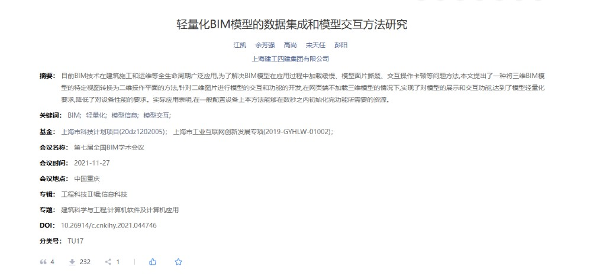
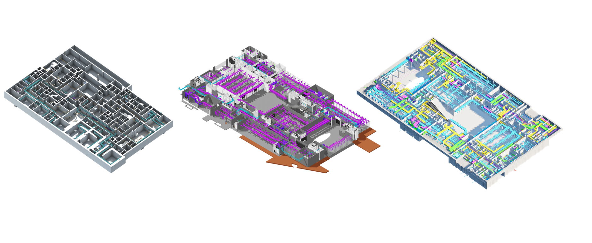

## 项目开发背景

与游戏行业不同，数字孪生项目很少配备专职建模师。展示模型大多直接来源于 Revit 或 SketchUp，这类 BIM 软件的导出模型面数极高，且缺乏针对实时渲染的拓扑优化。实的更现问题是，公司领导通常不会接受为此搭建一套完整的高低模处理流程——成本高、周期长，而项目交期往往就摆在那里。

在 Unreal Engine 项目里，这个问题还能靠 Nanite 硬扛。但当展示载体换成 Web 浏览器时，WebGL 的性能上限就远没那么宽裕了。面对一栋动辄数百万面的 BIM 建筑，实时渲染几乎无从下手。

这个项目的出发点就是：**在不触碰模型本身、不依赖人工减面的前提下，找到一条让 BIM 模型在 Web 端流畅展示的路。**

思路的转变来自地图：地图系统也要在浏览器里展示海量的地理数据，它的解法是预渲染切片——把数据离线渲染成瓦片图集，前端只负责按视野按需加载对应的图片。BIM 模型的展示需求和地图高度相似：视角固定在俯视方向，关注的是空间布局与设备分布，而不是自由的三维漫游。

沿着这个思路，方案逐渐清晰：**在服务端对 BIM 模型进行多视角、高分辨率的离线渲染，利用脚本切分瓦片图集，再借助 OpenLayers 在浏览器端实现高性能加载与交互。** 前端完全不接触原始三维数据，渲染压力从客户端转移到了一次性的服务端预处理，同时保留了楼层切换、设备点选、图标定位等核心业务交互能力。

<a href="http://kns--cnki--net--https.cnki.mdjsf.utuvpn.utuedu.com:9000/kcms2/article/abstract?v=5qKCSu-RHigH6BsxKLP7CAVqcaJ5ky_0eyu4np0ZHMqDOA1PPsK95Q78CYoojlf-qyJJH9MYYeicCjmuiP-AQn4XGbWBhrgZygojJRC8SCN1-NZ0w1RYzB3lgxYiJ7phnrupY_Yc_NT7_Le9jwjoa9BYLSBQBL5m0FmARg1hHcnD2q_9WUb4dQ==&uniplatform=NZKPT" target="_blank" rel="noopener" style="color:#2563eb;font-weight:700">论文链接</a>



## 项目展示

## 出图渲染



核心出图方法经过了三代的技术，从Unity到Bimface到现在的Unreal，前两者已经是历史，目前
由于业务逻辑展示模型是按照 **“楼层-系统-方向”**来展示不同的建筑模型、管线模型和设备模型，每一张图片的命名格式为 **{buildingId}-{floorId}-{systemName}-{direction}**
所以前置就是需要在渲染每一张图的时候将当前的建筑、楼层以及相应系统的机电模型对应模型加以显示，将Camera设置为对应方向
并隐藏掉其余的模型，这部分可以通过不同图形引擎的脚本实现。

输出的json格式如下：

```json
{
  "type": "FeatureCollection",
  "PassRate": "总数：596,成功数量：596,失败数量：0,成功率：100%",
  "camPostion": [91.9562382974267, 211.199053243684, 153.5665040387687],
  "camUp": [-0.41266446011203317, 0.812045902957566, -0.41266147730346153],
  "camRight": [-0.7071067811864888, -2.5973483524788232e-6, 0.7071067811818357],
  "camSize": 143.84092934573374,
  "features": [
    {
      "TestFeedback": "Succeeded",
      "TestElementId": "elementid-8846454",
      "type": "Feature",
      "id": "device-209",
      "properties": {
        "name": "PAU-03-01"
      },
      "geometry": {
        "type": "Polygon",
        "coordinates": [[]]
      }
    }
  ]
}
```

其中

- `type` 固定为 `FeatureCollection`，整体遵循 GeoJSON 的组织方式，方便前端直接按要素集合读取。
- `PassRate` 用来记录本次轮廓计算的成功率，主要用于离线生成阶段排查模型、设备或脚本异常。
- `camPostion`、`camUp`、`camRight`、`camSize` 保存当前渲染相机的信息。前端并不需要真实还原三维相机，但需要利用这些参数把模型空间中的轮廓点映射到二维图片坐标中。
- `features` 是真正的业务要素列表，每一个 `Feature` 对应一个设备、管线或构件。`properties` 保存业务字段，`geometry.coordinates` 保存该对象在当前视角下投影后的二维轮廓。

也就是说，每一次离线出图并不是只生成一张静态图片，而是同时生成一份与图片严格对齐的索引数据。图片负责展示，JSON 负责交互。前端点选设备时，实际命中的不是三维模型，而是这份二维轮廓数据；业务系统再通过 `id` 或 `TestElementId` 反查对应设备详情。

这一点是整个方案能成立的关键：**把三维问题提前压缩成二维问题**。三维模型只在服务端渲染阶段短暂参与计算，浏览器端最终面对的是瓦片图片、二维多边形和少量业务属性，因此加载速度和交互复杂度都能控制在 Web 项目可接受的范围内。

其实

### unity:

unity的核心脚本包含以下几类：

- `PhotoManager/PhotoAllManager.cs`：拍摄基础设施，负责相机、Layer、角度切换和公共方法。
- `PhotoManager/PhotoGameObjectViewManager.cs`：CSV 模型管线，按楼层和机电系统批量出图，并生成完整设备轮廓。
- `PhotoManager/PhotoElementViewManager.cs`：运行时 Element 管线，按 ActiveElement 数据切换楼层和系统出图。
- `CorePhoto/TestRenderTexture.cs`：真正执行 8K 离屏截图。
- `CorePhoto/BoundInView.cs`：根据 Mesh 顶点计算当前视角下的取景范围。
- `CoreOutline/OutLineTool-DESKTOP.cs`：把 CSV 设备列表转换成轮廓 JSON。
- `CoreOutline/Mesh2DTask.cs`：Mesh 到二维轮廓点的核心算法。
- `CoreOutline/GEOFeatureCollectionP.cs`、`CoreOutline/GEOFeatureCollection.cs`：JSON 输出结构。

其中最关键的设计是：不要直接依赖 Unity Game 视图分辨率，也不要通过大量 `SetActive` 管理复杂模型的显隐，而是把“业务可见性”和“渲染可见性”分开。业务层先决定要拍哪些对象，渲染层统一通过 Layer 和相机 `cullingMask` 控制最终进图内容。

#### 通过专用 Layer 切换可见模型

`PhotoAllManager` 在初始化时会找到拍摄相机，给相机挂上 `TestRenderTexture`，并把相机的 `cullingMask` 设置为只看 `ShotLayer`。项目默认 `ShotLayer = 16`。

```csharp
public int ShotLayer = 16;

protected void Start()
{
    GetInstance = this;
    if (Camera == null)
        Camera = Camera.main;
    if (Camera.GetComponent<TestRenderTexture>() == null)
        Camera.gameObject.AddComponent<TestRenderTexture>();
    Camera.transform.eulerAngles = new Vector3(45,-45,0);
    Camera.cullingMask = 1<<ShotLayer;

    BuildingModel = GameObject.Find("建筑模型");
    SceneModelManagerCSV = GlobalManager.SceneModelManagerCSV;
    ModelDataSSC.InitializeModelDataSSC();
}
```

拍摄前，把目标对象以及它的所有子节点切到 `ShotLayer`；拍摄后再恢复原 Layer。这样做有两个好处：一是不用破坏原来的激活状态，二是相机天然只渲染当前批次对象。

```csharp
protected void SetSSCLayer(GameObject obj, int layer)
{
    if (!objLayerDic.ContainsKey(obj))
    {
        objLayerDic.Add(obj, -1);
    }

    if (objLayerDic[obj] == -1)
    {
        objLayerDic[obj] = obj.layer;
        obj.layer = layer;

        foreach (Transform childTr in obj.GetComponentsInChildren<Transform>(true))
        {
            childTr.gameObject.layer = layer;
        }
    }
}
```

对应的恢复逻辑也在同一个类中：

```csharp
protected void ResetSSCLayer(GameObject obj)
{
    if (objLayerDic.ContainsKey(obj))
    {
        if (objLayerDic[obj] != -1)
        {
            obj.layer = objLayerDic[obj];
            objLayerDic[obj] = -1;
            foreach (Transform childTr in obj.GetComponentsInChildren<Transform>(true))
            {
                childTr.gameObject.layer = obj.layer;
            }
        }
    }
}
```

这相当于给批量截图建立了一个“临时拍摄层”。业务模块只需要把要拍的对象交给 `SetSSCLayer`，渲染层就会自动过滤掉其他内容。

#### 按楼层和机电系统批量出图

CSV 管线的核心在 `PhotoGameObjectViewManager.WaitTakeSequenceScreenShot`。它先显示当前楼层，然后从 `SceneModelManagerCSV.ElementData.CSVLevelIdToMMepSystemIds` 找到这个楼层包含的 MEP 系统，再通过 `ModelDataSSC.MEPToSystem` 聚合成系统大类。

```csharp
SceneModelManagerCSV.LevelManager.ShowOneLevel(levelId);

var levelSystemIds = new List<int>();

if (SceneModelManagerCSV.ElementData.CSVLevelIdToMMepSystemIds.ContainsKey(lvlBehaviour.FMUnitInfo.LevelID))
{
    levelSystemIds = SceneModelManagerCSV.ElementData.CSVLevelIdToMMepSystemIds[lvlBehaviour.FMUnitInfo.LevelID];

    foreach (var sysId in levelSystemIds)
    {
        allElements.AddRange(SceneModelManagerCSV.ElementData.CSVGameObjectDicByMEPSystemID[sysId].Where(x => x.m_ElementInfo.LevelID == levelId));
    }
}

Dictionary<int, List<int>> systemIds = new Dictionary<int, List<int>>();

if (levelSystemIds != null && levelSystemIds.Count() != 0)
{
    systemIds = levelSystemIds.Select(x => new
    {
        sysId = x,
        typeId = ModelDataSSC.MEPToSystem[x]
    }).GroupBy(y => y.typeId).ToDictionary(x => x.Key, x => x.Select(y => y.sysId).ToList());
}
```

之后它会在每个相机角度下依次拍摄：

- 单层单系统图：按 `typeId` 分组，只显示该系统大类。
- 单层全系统图：显示该楼层所有系统，并按系统大类着色。
- 单层无系统图：用于保留建筑或背景视图。
- 整楼系统图：在 `AllSystemShot` 中处理所有楼层。

单系统截图的核心流程如下：

```csharp
foreach (var typeId in systemIds.Keys)
{
    string pathHead = lvlBehaviour.FMUnitInfo.BuildingID + "-"+ lvlBehaviour.m_LevelInfo.DataBaseID + "-" + typeId;
    string logName = Path1 + pathHead + "-" + CurrentCount;

    List<GameObject> objs = new List<GameObject>();
    List<FMCSVUnitBehaviour> device = new List<FMCSVUnitBehaviour>();

    foreach (var sysId in systemIds[typeId])
    {
        if (ModelDataSSC.MEPToMEPColor.ContainsKey(sysId)) color = ModelDataSSC.MEPToMEPColor[sysId];
        var systemIdElement = SceneModelManagerCSV.ElementData.CSVGameObjectDicByMEPSystemID[sysId].Where(x => x.m_ElementInfo.LevelID == levelId);
        GlobalManager.Colors.SetCSVSystemColor(systemIdElement.Select(x => x as IColorChangeSimple).ToList(), color);

        objs.AddRange(SceneModelManagerCSV.ElementData.CSVGameObjectDicByMEPSystemID[sysId].Select(x => x.m_ElementInfo.GameObject).ToList());
        device.AddRange(SceneModelManagerCSV.ElementData.CSVGameObjectDicByLevelID[levelId].Where(x => x.m_ElementInfo.DeviceID != null && x.m_ElementInfo.MEPSystemIDs.Contains(sysId)).Select(x => x as FMCSVUnitBehaviour).ToList());
    }

    SetSSCLayer(objs, ShotLayer);
    yield return null;

    if(m_Shot)
        Camera.GetComponent<TestRenderTexture>().TakePhoto(logName);

    if (m_OutLine && device.Count() != 0)
    {
        string jsonPath = Path1 + pathHead;
        if (!Directory.Exists(jsonPath))
            Directory.CreateDirectory(jsonPath);
        OutLineTool.CreateOutlineJson(device, Camera, jsonPath+"/"+"Outline - "+CurrentCount+".json");
        yield return null;
    }

    ResetSSCLayer(objs);
    yield return null;
}
```

这里可以看到图片和轮廓 JSON 是同一轮相机状态下生成的，因此 JSON 中的二维轮廓可以和 PNG 对齐。

#### 8K离屏渲染

Unity 默认 Game 视图并不适合稳定输出 8K 图。项目使用 `RenderTexture` 离屏渲染：先创建 `8192 x 8192` 的 RT，把它绑定到相机 `targetTexture`，调用 `cam.Render()`，再用 `Texture2D.ReadPixels` 读回并编码为 PNG。

```csharp
public void TakePhoto(string LogName)
{
    rt = new RenderTexture(8192, 8192, 24);
    cam.targetTexture = rt;
    cam.Render();
    RenderTexture.active = rt;

    TextureFormat textureFormat = TextureFormat.RGBA32;
    Texture2D tex = new Texture2D(8192, 8192, textureFormat, false);
    tex.ReadPixels(new Rect(0,0, 8192, 8192),0,0);
    tex.Apply();
    cam.targetTexture = null;

    byte[] bytes;
    string suffix = ".png";
    bytes = tex.EncodeToPNG();
    File.WriteAllBytes(LogName+suffix,bytes);

    Destroy(tex);
    RenderTexture.active = null;
    GameObject.Destroy(rt);
    rt = null;
}
```

### unreal:

Unreal 后续成为主要方案，核心原因是它对工程软件模型的接入更友好。通过 **Datasmith**，Revit、3dMax等软件中的模型层级、材质和基础属性可以相对完整地导入 Unreal。虽然原始材质直接渲染出来并不一定美观，有时甚至有点辣眼睛，但它显著降低了 BIM 模型进入实时渲染管线的门槛。因此，后续的模型客户端和离线出图流程都逐步转向 Unreal。

Unreal 版本没有继续沿用自定义离屏截图脚本，而是改为基于 **Movie Render Queue** 做离线出图。MRQ 本身就是 Unreal 官方提供的高质量渲染管线，能够更稳定地处理高分辨率输出、抗锯齿、后处理、序列帧管理和批量任务，相比自己维护一套截图逻辑，可靠性和可配置性都更好。

8K 输出主要依赖 MRQ 中的 **High Resolution Rendering**。普通一次性渲染 8192×8192 图像时，显存压力会非常大，尤其是 BIM 模型本身面数高、材质多、场景层级复杂，很容易出现渲染失败、显存溢出或输出不稳定的问题。High Resolution Rendering 的思路是把一张大图拆成多个 tile 分块渲染，最后再由 Unreal 合成为完整图片。

当前一般将 Tile Count 设置为 `4`，也就是把最终画面拆成 `4 × 4 = 16` 个 tile 分块渲染。这样每次实际渲染的区域更小，单次显存占用明显降低，同时仍然可以得到完整的 8K 输出结果。

在这套流程里，Unreal 主要负责三件事：

- 根据业务组合切换当前需要展示的楼层、系统和方向。
- 通过 Movie Render Queue 输出对应视角下的高分辨率图片。
- 保证每张图片的相机位置、正交尺寸、命名规则和后续瓦片切分脚本保持一致。

相比 Unity 方案，Unreal 的优势不只是画质更好，更重要的是把高分辨率出图交给官方渲染队列处理。后续无论是调整分辨率、抗锯齿、采样质量、后处理效果，还是扩展批量渲染任务，都可以通过 MRQ 配置完成，不需要频繁修改底层截图代码。

这部分批量出图的自动化逻辑主要通过 Python 脚本串联：脚本负责切换楼层、系统和相机方向，调用 MRQ 渲染任务，并按约定的命名规则输出图片，方便后续瓦片切分和前端加载。

#### MRQ中的Actor组织

Unreal中的构件，应该叫Actor的显隐并不是很好做，虽然将父Actor设置为在游戏中隐藏，但是子actor并不会对应隐藏，所以对于这种情况

## 获取设备边界

如果只有图片，页面最终只能停留在“查看模型”的层面，用户看到的是一张被渲染好的二维结果，却无法知道每一个设备、管线或构件在图中的具体位置，也无法继续承载点选、查询和业务联动。

因此，在生成模型图片的同时，还需要为图中的关键对象生成一份对应的边界数据。图片负责视觉展示，边界数据负责说明“哪些区域属于哪个对象”。有了这层数据之后，前端才能把一张静态图片还原成可交互的业务界面。

这部分数据主要服务于三类能力：

- **设备点选**：用户点击图中的某个区域时，可以识别出对应的设备或构件。
- **信息联动**：选中对象后，可以展示名称、编号、状态、所属系统等业务信息。
- **状态表达**：后续可以根据设备状态，在对应区域上叠加高亮、报警、定位等视觉反馈。

也就是说，设备边界并不是额外的展示素材，而是二维化方案中最关键的交互索引。它把离线渲染得到的图片和真实业务对象重新关联起来，让浏览器端不需要加载三维模型，也能完成接近数字孪生客户端的点选和联动体验。

## 交互逻辑
