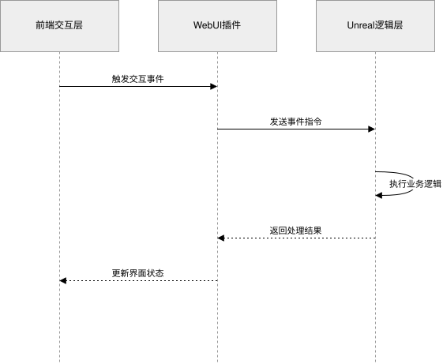
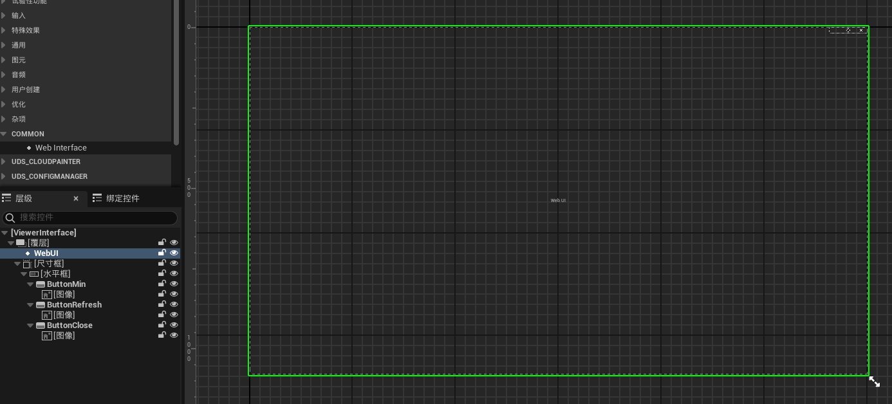
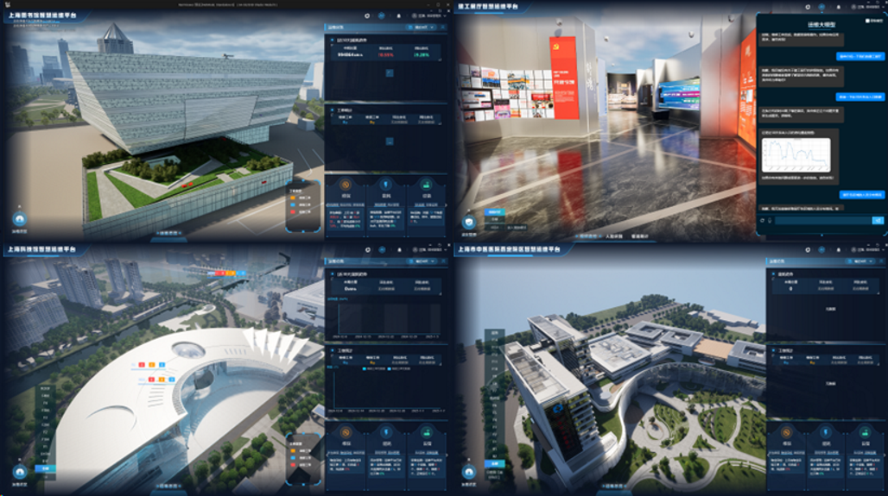

## 前言

数字孪生可视化算是部门早期的核心业务之一。最开始承接东方医院建筑运维项目时，这类 BIM 模型应用落地在当时还比较新，主要目标是开发一个图形引擎，在三维场景中实现楼层切换、设备点选、系统切换等模型逻辑。

项目起初基于 Unity 开发：将 BIM 模型导入 Unity，再通过 WebView2 启动 Unity 进程展示模型，并实现 Unity 与前端页面之间的通信。这个方案开发起来比较方便，但也暴露出一个明显问题：部门里没有专职美术人员，模型通常只是把 FBX 直接导入 Unity，最多给建筑模型补一张阴影贴图。即使后来尝试切换到 HDRP 渲染管线，整体展示效果仍然不够理想。

后来方案逐步转向 Unreal Engine。相比 Unity，Unreal 在数字孪生场景里有几个比较明显的优势：一是 Datasmith 对 Revit、3ds Max、Rhino、SketchUp 等建模软件支持更好，可以在转换并导入 UE 时保留一部分材质信息；二是 Lumen 和 Nanite 降低了光照调试与高面数模型承载的门槛，对于 BIM 这类面数复杂、材质来源不统一的模型更加友好。

目前也是做了上海很多医院还有文博场馆的项目，比如东方医院、新华医院、上博、上图

## 技术架构

RemViewer 的整体思路可以概括为一句话：**Web 做 UI，UE 做 Viewer**。前端页面负责承载业务界面和用户操作，Unreal Engine 负责 BIM 模型渲染、场景管理和空间交互，两者之间通过一套 JSON 消息协议进行双向通信。

客户端整体上可以拆成前端交互层、WebUI 插件和 Unreal 逻辑层三部分。前端触发交互事件后，经由 WebUI 插件转发到 Unreal 逻辑层；UE 侧完成楼层切换、设备高亮、系统展示、路径漫游等逻辑后，再将处理结果回传给前端，用于更新界面状态。



UE 部分的代码逻辑图如下：


## 入口层：GameMode、Pawn 与 PlayerController

UE 项目的启动链条从 `GameMode` 开始。在这个项目里，`GameMode` 本身不承担业务逻辑，主要负责指定默认的 Pawn 和 PlayerController，让引擎在运行时自动创建对应实例。

```cpp
ARemViewerGameMode::ARemViewerGameMode()
{
    DefaultPawnClass = ARemViewerPawn::StaticClass();
    PlayerControllerClass = ARemViewerPlayerController::StaticClass();
}
```

`ARemViewerPawn` 负责相机和输入控制。它内部维护 `SpringArm` 与 `Camera` 组件，并根据键盘、鼠标和滚轮输入更新相机位置、旋转和臂长。每帧逻辑大致可以拆成缩放、平移、旋转、插值和状态回传几个阶段，通过平滑插值避免相机突变带来的抖动。

```cpp
void ARemViewerPawn::LerpToDesiredStatus()
{
    FVector LastLocation = CameraSpringArm->GetComponentTransform().GetLocation();
    FVector Location = DesiredLocation + Offset;
    LastLocation = FMath::Lerp(LastLocation, Location, 0.2f);
    SetActorLocation(LastLocation);
}
```

`ARemViewerPlayerController` 更像是整个客户端逻辑的装配入口。模型管理、楼层加载、设备选择、热力图、管线流向、灯光控制、空调管理、空间路线等组件都由它创建和管理，组件生命周期也跟随 PlayerController 统一维护。

```cpp
ARemViewerPlayerController::ARemViewerPlayerController()
{
    ModelComponent = NewObject<URemModelManagerComponent>();
    PathComponent = CreateDefaultSubobject<URemPathComponent>(TEXT("PathComponent"));
    RoomComponent = CreateDefaultSubobject<URemRoomComponent>(TEXT("RoomComponent"));
    HeatMapComponent = CreateDefaultSubobject<URemHeatMapComponent>(TEXT("HeatMapComponent"));
    SelectComponent = CreateDefaultSubobject<USelectManagerComponent>(TEXT("SelectComponent"));
    AirComponent = CreateDefaultSubobject<UAirConditionComponent>(TEXT("AirComponent"));
    LightComponent = CreateDefaultSubobject<ULightControlComponent>(TEXT("LightComponent"));
    MapManagerComponent = CreateDefaultSubobject<UMapManagerComponent>(TEXT("MapManagerComponent"));
    SpaceRouteComponent = CreateDefaultSubobject<USpaceRouteComponent>(TEXT("SpaceRouteComponent"));
}
```

这种设计的好处是入口清晰：`Pawn` 专注相机和输入，`PlayerController` 专注组件装配和运行期调度，业务组件之间通过事件和委托进行通信，避免把所有逻辑堆在一个类里。

## 通信层：Web 与 UE 的消息桥

通信层是这个系统最核心的基础设施。它负责把前端页面中的按钮点击、菜单切换、设备选择等事件转发到 UE，同时也负责把 UE 场景中的选中结果、相机状态、业务处理结果回传给 Web 页面。

整体通信路径可以理解为：

```text
Web 前端 -> Browser(WebInterface) -> UserWidget -> WebBridge -> UE 组件
UE 组件 -> WebBridge -> UserWidget -> Browser.Call(...) -> Web 前端
```

### UserWidget：WebInterface 的封装

首先是新建一个用户组件类，定义通用的窗口操作、消息传递和页面设置方法。这个类继承自 `UUserWidget`，内部保存 `UWebInterface` 实例，用来加载前端页面并接收 Web 侧事件。

```cpp
UCLASS()
class REMVIEWER_API URemViewerUserWidget : public UUserWidget
{
	GENERATED_BODY()

public:

	UFUNCTION(BlueprintCallable, Category = "Rem")
		void CloseButtonClick();

	UFUNCTION(BlueprintCallable, Category = "Rem")
		void MinButtonClick();

	UFUNCTION(BlueprintCallable, Category = "Rem")
		void RefreshButtonClick();

	UFUNCTION(BlueprintCallable, Category = "Rem")
		void SetupWebUI(UWebInterface* Widget);

	UFUNCTION(Exec)
		void SetWebUrl(FString Url);

	UFUNCTION()
		void OnWebMessage(const FName Name, FJsonLibraryValue Data, FWebInterfaceCallback CallBack);

	UFUNCTION()
		void OnUeMessage(const FString& Name, const FString& Data);

protected:
	FString WebUrl;
	UWebInterface* Browser;

};
```

随后就可以在 UE 中创建一个用户组件，继承上面的 C++ 类，并在蓝图里配置 WebUI 组件。



核心初始化逻辑集中在 `SetupWebUI` 里。这里先从项目配置的 `Homepage` 字段读取前端页面地址，并将蓝图里传入的 `UWebInterface` 保存下来，作为后续加载页面和接收前端事件的浏览器实例。随后开启输入法支持，加载 Web 页面，并把 WebUI 插件抛出的前端事件绑定到 `OnWebMessage`，这样前端按钮点击、菜单切换等操作就能进入 UE 侧处理。

后半部分主要负责绑定 UE 到前端的反向消息通道。项目里既保留了全局的 `URemWebBridge` 单例，也通过 `URemGameInstanceSubsystem` 维护运行期消息分发，创建 `URemGameInstanceSubsystem`是为了在蓝图中能方便订阅消息，因此这里同时订阅它们的 `OnUeMessage` 事件。当 UE 场景逻辑需要通知前端更新状态时，消息会统一进入 `OnUeMessage`，再由 WebUI 层回传给页面。

```cpp
void URemViewerUserWidget::SetupWebUI(UWebInterface* Widget)
{
	GConfig->GetString(TEXT("/Script/EngineSettings.GeneralProjectSettings"), TEXT("Homepage"), WebUrl, GGameIni);
	Browser = Widget;
	Browser->EnableIME();
	Browser->LoadURL(WebUrl);
	Browser->OnInterfaceEvent.AddDynamic(this, &URemViewerUserWidget::OnWebMessage);

	URemWebBridge::GetInstance().OnUeMessage.AddDynamic(this, &URemViewerUserWidget::OnUeMessage);
	auto GameInstance = GetWorld()->GetGameInstance();
	auto Subsystem = GameInstance->GetSubsystem<URemGameInstanceSubsystem>();
	Subsystem->OnUeMessage.AddDynamic(this, &URemViewerUserWidget::OnUeMessage);
}
```

`OnWebMessage` 和 `OnUeMessage` 分别对应两个方向的消息流。Web 发来的消息会被转发到全局消息桥和 `GameInstanceSubsystem`；UE 发给 Web 的消息则通过 `Browser->Call` 调用前端约定好的 JavaScript 方法。

```cpp
void URemViewerUserWidget::OnWebMessage(
    const FName Name,
    FJsonLibraryValue Data,
    FWebInterfaceCallback CallBack)
{
    URemWebBridge::GetInstance().SendToUe(Name.ToString(), *Data.Stringify());

    auto Subsystem = GetWorld()->GetGameInstance()->GetSubsystem<URemGameInstanceSubsystem>();
    Subsystem->OnWebMesssage.Broadcast(Name.ToString(), *Data.Stringify());
}

void URemViewerUserWidget::OnUeMessage(const FString& Name, const FString& Data)
{
    Browser->Call(Name, Data);
}
```

### WebBridge：全局消息总线

`URemWebBridge` 是项目中的全局消息总线，内部维护两个多播委托：一个负责 Web 到 UE，另一个负责 UE 到 Web。各个功能模块只需要订阅自己关心的消息，不需要直接依赖 WebUI 或其他组件。

```cpp
UCLASS()
class REMVIEWER_API URemWebBridge : public UObject
{
public:
    DECLARE_DYNAMIC_MULTICAST_DELEGATE_TwoParams(
        FWebBridgeDelegate,
        const FString&, Name,
        const FString&, Data);

    static URemWebBridge& GetInstance();

    FWebBridgeDelegate OnWebMesssage;
    FWebBridgeDelegate OnUeMessage;
};
```

这本质上是一个发布-订阅模式。发送方只负责广播事件，接收方通过 `AddDynamic` 绑定自己的处理函数。新增功能时，只要监听对应消息名即可，不需要改动通信层本身。

### GameInstanceSubsystem：跨地图的持久化消息

除了全局单例，项目里还使用 `URemGameInstanceSubsystem` 维护一部分跨地图的运行期状态。它的生命周期与 `GameInstance` 一致，不会因为关卡切换而销毁，因此适合放置展品信息缓存、电梯数据、全局消息分发等内容。

```cpp
void URemGameInstanceSubsystem::BeginPlay(const FString& Name, const FString& Data)
{
    if (Name == "setImageExhibitsInfo" || Name == "setExhibitsInfo")
    {
        ExhibitHallDataDic.Add(Name, Data);
    }

    if (Name == "setElevator" && Data != "[]")
    {
        OpenMap.Broadcast("Elevator");
        InitElevatorData(Data);
    }
    else if (Name == "setElevator" && Data == "[]")
    {
        CloseMap.Broadcast("Elevator");
    }
}
```

创建 `URemGameInstanceSubsystem` 还有一个实际原因：它可以更方便地在蓝图中订阅消息，适合把 C++ 逻辑、蓝图逻辑和 Web 消息连接起来。

## 核心数据层：ModelManager 的事件分发

`URemModelManagerComponent` 是整个系统的中央数据枢纽。它监听 Web 端下发的场景数据和设备数据，并在解析后通过一组委托向下分发，让楼层、设备、管线、材质、地面和暗黑模式等模块各自响应。

```cpp
void URemModelManagerComponent::BeginPlay()
{
    URemWebBridge::GetInstance().OnWebMesssage
        .AddDynamic(this, &URemModelManagerComponent::SetSceneInfo);

    URemWebBridge::GetInstance().OnWebMesssage
        .AddDynamic(this, &URemModelManagerComponent::SetDevice);
}
```

例如 Web 端发送 `setScene` 时，数据里会包含楼层 ID、场景名称、系统颜色、透明度等配置。`ModelManager` 解析 JSON 后，再通过委托广播给具体功能组件：

```cpp
FloorChangeDelegate OnFloorChange;
FDarkModeDelegate OnDarkModeChange;
FGroundChangeDelegate OnGroundChange;
FTransparentChangeDelegate OnTransparentChange;
FDeviceChangeDelegate OnDeviceChange;
FSceneChangeDelegate OnSceneChange;
FSystemColor OnSystemColorChange;
FShowDetailedModelDelegate OnShowDetailedModel;
```

一个典型流程是：前端请求展示某个楼层的空调系统，`ModelManager` 解析出楼层、系统类型和颜色配置，然后分别广播楼层切换、设备显示、管线着色等事件。每个组件只处理自己关心的部分，不需要知道消息最初来自哪个页面按钮。

```text
Web 发送 setScene
  -> ModelManager 解析 JSON
    -> OnFloorChange.Broadcast(...)      加载对应楼层
    -> OnSceneChange.Broadcast(...)      展示或隐藏设备
    -> OnSystemColorChange.Broadcast(...) 切换系统颜色
```

## 功能组件层：独立的可视化模块

功能层由多个 `UActorComponent` 组成，每个组件关注一个相对独立的业务能力，并由 `PlayerController` 统一创建和管理。

| 组件                      | 职责           | 典型能力                               |
| ------------------------- | -------------- | -------------------------------------- |
| `UMapManagerComponent`    | 地图与楼层管理 | 楼层加载、卸载、地面切换、精细模型显示 |
| `USelectManagerComponent` | 选择与高亮     | 射线检测、Hover、Select、描边          |
| `URemRoomComponent`       | 房间空间展示   | 房间边界生成、三角剖分、标签显示       |
| `URemPathComponent`       | 管线流向展示   | 生成 Procedural Path、展示系统流向     |
| `URemHeatMapComponent`    | 热力图         | 根据数据生成纹理并映射到场景           |
| `USpaceRouteComponent`    | 空间路线       | Spline 路径、路线展示、自动漫游        |
| `UAirConditionComponent`  | 空调设备管理   | 空调状态展示、设备显隐                 |
| `ULightControlComponent`  | 灯光设备管理   | 灯具状态切换、亮灭控制                 |
| `USystemPipeComponent`    | 管道系统着色   | 管线颜色、透明度和状态切换             |

### 选择管理器：每帧射线检测

`USelectManagerComponent` 是一个典型的每帧轮询组件。它在 `TickComponent` 中根据鼠标位置做射线检测，并区分 Hover 和 Select 两种状态。当选中对象变化时，组件会把结果回传给 Web 前端，让前端信息面板同步更新。

```cpp
void USelectManagerComponent::TickComponent(float DeltaTime, ...)
{
    FHitResult HitResult;
    PlayerController->GetHitResultUnderCursorForObjects(TraceChannel, false, HitResult);

    if (HighlightedActor != HitResult.GetActor())
    {
        HighlightedActor = HitResult.GetActor();
        SendToWeb("setHover", HighlightedActor);
    }

    if (PlayerController->WasInputKeyJustPressed(EKeys::LeftMouseButton))
    {
        SelectedActor = HitResult.GetActor();
        SendToWeb("setSelection", SelectedActor);
    }
}
```

选中和悬停的视觉反馈由描边子系统完成。这样 UE 负责准确拾取和渲染效果，Web 负责展示业务属性，两边职责比较清晰。

### 空间路线漫游：Spline 与 Timeline

`USpaceRouteComponent` 负责空间路线展示和自动漫游。路线点位从 Web 端下发后，UE 根据点位创建 `SplineComponent`，再沿 Spline 生成对应的路径模型。需要漫游时，`Timeline` 驱动相机沿 Spline 插值移动。

```cpp
void USpaceRouteComponent::CreateSpaceRoute(FRouteData RouteData)
{
    USplineComponent* SplineComp = NewObject<USplineComponent>(RouteContainer);

    for (int i = 0; i < RouteData.Path.Num(); i++)
    {
        SplineComp->AddSplinePoint(RouteData.Path[i], ESplineCoordinateSpace::Local);
    }
}

void USpaceRouteComponent::MovePawn(float Value)
{
    auto AlongDistance = FMath::Lerp(0, Length, Value);
    auto Position = CurrentRoamingRoute.Spline
        ->GetTransformAtDistanceAlongSpline(AlongDistance, ESplineCoordinateSpace::World)
        .GetLocation();

    Pawn->DesiredLocation = Position;
}
```

这套逻辑让前端只需要下发路线数据和开始漫游指令，具体的路径生成、动画播放和相机移动都在 UE 侧完成。

## 实体 Actor 层：场景中的可视化对象

实体 Actor 层承载的是场景里实际可见、可交互的对象：

- `ABuildingLevel`：对应建筑楼层，管理楼层内的静态网格、材质切换、透明模式和暗黑模式。
- `AExhibitionActor`：用于文博场馆中的展品管理，维护展品信息、图片换展、位置调整和存档恢复。
- `AElevatorBox` / `AElevatorCar`：电梯系统实体，由 `GameInstanceSubsystem` 中的电梯数据驱动。
- `ALightControlActor` / `AAirConditionActor`：灯光和空调设备实体，由对应组件负责创建、销毁和状态更新。

这些 Actor 并不直接处理 Web 消息，而是由上层组件在收到消息后驱动。这样可以把“消息解析”和“场景表现”拆开，降低实体对象之间的耦合。

## 支撑子系统

除了核心组件，项目里还有一些支撑型子系统：

- `URemOutlineGameInstanceSubsystem`：基于后处理的多颜色描边系统，用于 Hover、Selected、Model 等不同状态的可视化反馈。
- `URemTriangulator`：三角剖分工具库，为房间多边形生成三角网格。
- `URemDarkModeManager`：暗黑模式管理，统一控制天光、太阳强度等全局光照参数。
- `URemSaveGame`：存档对象，用于持久化展品布局等运行期数据。

## 设计总结

这个项目里最关键的设计是 **Singleton + Delegate** 的解耦消息架构。`WebBridge` 和 `ModelManager` 都通过 UE 的多播委托构建发布-订阅关系，新增功能模块时，不需要修改既有通信代码，只要订阅对应消息并处理自己的业务即可。

另一个贯穿全局的约定是 **JSON 作为跨端数据协议**。Web 前端和 UE 之间所有业务数据都用 JSON 传递，前端负责组装业务语义，UE 侧使用 `FJsonSerializer`、`FJsonObject`、`TJsonReader`、`TJsonWriter` 等工具完成序列化和反序列化。

```cpp
TSharedPtr<FJsonObject> JsonObject = MakeShareable(new FJsonObject);
JsonObject->SetStringField("name", Name);

FString JsonString;
TSharedRef<TJsonWriter<>> Writer = TJsonWriterFactory<>::Create(&JsonString);
FJsonSerializer::Serialize(JsonObject.ToSharedRef(), Writer);

URemWebBridge::GetInstance().SendToWeb("updateState", JsonString);
```

RemViewer 的架构可以归结为：**Web 发指令，UE 执行渲染，WebBridge 做中转，Delegate 做分发**。这种分工让前端和 UE 可以相对独立地开发和部署，只要约定好消息名称和 JSON 数据结构，就能持续扩展新的模型交互能力。

## 一些项目



## 效果展示

### 房间空间展示


### 管线流向展示


