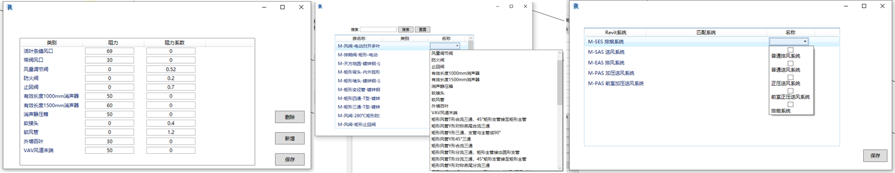
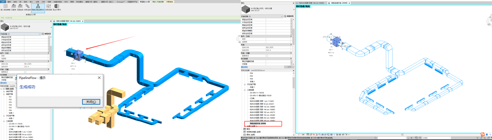
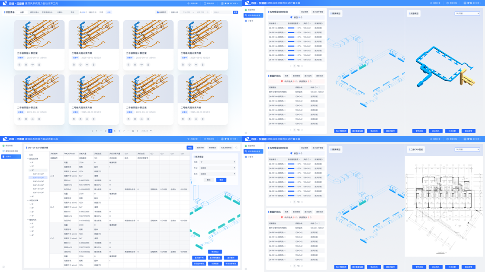

## 前言

这个工具最初来自集团安装公司的业务需求，主要服务于机电深化设计中的风系统校核场景。由于我并不是机电专业出身，对具体设计规范没有做过特别深入的研究，所以这里更多是从软件实现和业务流程的角度，梳理一下这个工具要解决的问题。

在实际项目中，设计院通常会先给出系统图和相对粗略的设计图，明确机房位置、风机布置以及主管的大致走向。但更细节的内容，比如支管如何布置、弯头和三通放在哪里、管径如何调整等，往往需要由机电深化设计继续完成。

不过，机电深化并不是自由画管线。深化完成后，还需要对整套风管系统进行阻力计算，校核结果必须满足风机选型和设计风量的要求。换句话说，只有当这套管网在当前风机型号下，能够保证各个风口达到设计风量，深化方案才算真正可用。

这个工具要解决的，就是把原本依赖人工拆路径、查表和汇总的阻力计算过程自动化，减少重复劳动和计算误差，让深化设计人员可以更快判断当前管网方案是否合理。

传统人工核算时，通常会先依靠经验选出一条“看起来最不利”的路径，再对照深化完成的 Revit 模型或导出的 CAD 图纸，沿着风管一段一段地统计参数并计算阻力。稍微自动化一些的做法，是由工程师自己编写 Excel VBA 脚本，把查表和公式计算放到表格里完成，但风量、管径、长度、弯头、三通等关键参数仍然需要人工从图纸中读取并录入。整体来看，这类流程只是把“计算”部分半自动化了，路径识别、参数提取和结果校核仍然高度依赖人工经验。

#### 计算方法

从风管设计的基本流程来看，首先要根据生产工艺和建筑空间对通风空调系统的要求，确定风管系统的形式、走向、空间位置、风口布置以及风管断面尺寸。对于公共建筑来说，风管高度和走向往往还会受到吊顶空间、梁高、其他机电管线综合排布等因素限制。

在深化设计阶段，管线布置完成后还需要计算风管系统的压力损失。图片里的核心公式可以概括为：

$$
\Delta P = \Delta P_m + \Delta P_j 
$$

其中，$\Delta P$ 表示风管系统的总压力损失，$\Delta P_m$ 表示沿程压力损失，$\Delta P_j$ 表示局部压力损失。沿程压力损失主要来自空气在直管段中流动时与管壁产生的摩擦；局部压力损失则来自弯头、三通、变径、阀门、风口等构件导致的气流方向或截面变化。

##### 沿程压力损失计算

先看沿程压力损失 $\Delta P_m$。它只和风管直管段有关，计算时需要先确定每一段风管的风量、管径或截面尺寸、管内风速以及风管长度。对于圆形风管，风量可以按下式计算：

$$
L = 900\pi d^2 V
$$

对于矩形风管，风量可以按下式计算：

$$
L = 3600abV
$$

其中，$L$ 表示风量，单位为 $\mathrm{m^3/h}$；$d$ 表示圆形风管内径，单位为 $\mathrm{m}$；$a$、$b$ 分别表示矩形风管截面的净宽和净高，单位为 $\mathrm{m}$；$V$ 表示管内风速，单位为 $\mathrm{m/s}$。

**难点 1：下游风量统计**

手工计算时，第一个难点就是确定每一段风管承担的风量。某一段管道的风量并不是单独给定的，而是由它下游所有风口的设计风量累加得到。以往核算时，通常是在 Revit 中完成深化建模后，再导出 CAD 图纸，由人工顺着图纸一段管、一段管地追踪下游风口并手动汇总。这种方式不仅效率低，而且很容易在分支较多、管线交错复杂的系统中漏算或重复计算。

得到风量和风速后，单段直管的沿程压力损失可以写成：

$$
\Delta P_m = \Delta p_m l
$$

其中，$\Delta p_m$ 表示单位管长沿程摩擦阻力，单位为 $\mathrm{Pa/m}$；$l$ 表示该段风管长度，单位为 $\mathrm{m}$。单位管长摩擦阻力继续按下式计算：

$$
\Delta p_m = \frac{\lambda}{d_e}\frac{V^2}{2}\rho
$$

其中，$\lambda$ 表示摩擦阻力系数，$\rho$ 表示空气密度，$d_e$ 表示风管当量直径。

摩擦阻力系数 $\lambda$ 和风管内壁粗糙度、当量直径以及气流状态有关，可按下式计算：

$$
\frac{1}{\sqrt{\lambda}} = -2\log\left(\frac{K}{3.71d_e} + \frac{2.51}{Re\sqrt{\lambda}}\right)
$$

其中，$K$ 表示风管内壁的绝对粗糙度，单位为 $\mathrm{m}$；$Re$ 表示雷诺数。雷诺数用于判断气流的流动状态，计算公式为：

$$
Re = \frac{Vd_e}{\nu}
$$

其中，$\nu$ 表示空气运动黏度，单位为 $\mathrm{m^2/s}$。需要注意的是，$\lambda$ 同时出现在公式左右两侧，所以它不是代入一次就能直接得到的参数，程序里一般会给一个初始值，然后通过迭代计算到结果收敛。

对程序来说，每一段直管只要能拿到长度、截面尺寸和风量，就可以推算风速、当量直径、雷诺数和摩擦阻力系数，进而计算出该段的 $\Delta P_m$；一条路径上的沿程阻力就是这些直管段沿程损失的累加。

##### 局部压力损失计算

再看局部压力损失 $\Delta P_j$。当气流经过弯头、三通、变径、阀门、风口等构件时，流动方向、流通截面或流量分配会发生变化，气流会产生额外的能量损失，这部分就称为局部压力损失。其计算公式为：

$$
\Delta P_j = \zeta \frac{V^2}{2}\rho
$$

其中，$\zeta$ 表示局部阻力系数；$V$ 表示局部压力损失发生处的空气流速，单位为 $\mathrm{m/s}$；$\rho$ 表示空气密度，单位为 $\mathrm{kg/m^3}$。

局部阻力系数 $\zeta$ 一般不是通过统一公式直接算出来的，而是根据构件类型和几何参数查表或按规范取值。例如弯头会受到转弯角度、曲率半径和截面形状影响；三通会受到主管、支管风量分配比例和夹角影响；阀门则和阀门类型、开度有关。因此在程序里，需要先识别当前路径经过了哪些局部构件，再根据构件类型匹配对应的 $\zeta$，最后按该构件所在位置的风速计算 $\Delta P_j$。

$\zeta$ 就是查询红宝书，即 **《实用供热空调设计手册第二版(上册)》**,里面有各种构件，三通，天圆地方啥的实验室数据，各种表格，根据具体工况，查询对应构件的阻力系数，表格的系数也是各种各样，这也是其中一个难点，因为不同构件查询所需要的参数各不相同，查询也是个问题。

一条风路上的局部阻力，就是这条路径上所有局部构件压力损失的累加。它和沿程阻力不同：沿程阻力主要跟“管段长度”相关，而局部阻力主要跟“构件类型”和“气流状态变化”相关。

所以这个工具的计算思路并不是单独计算某一段风管，而是先把整套风系统抽象成一张管网：直管段负责提供长度、截面、风量等沿程阻力参数，弯头、三通、阀门等节点负责提供局部阻力参数。程序再根据风机到各个风口的路径，自动识别每条支路需要经过哪些管段和构件，分别计算并汇总 $\Delta P_m$ 和 $\Delta P_j$。

最终得到的结果可以用来判断当前深化方案是否满足风机选型要求：如果某条路径阻力过大，就说明该支路可能需要调整管径、优化走向、减少局部构件，或者重新复核风机余压。也就是说，软件做的事情本质上是把人工“拆路径、查参数、算阻力、汇总校核”的过程自动化。

<a href="http://kns--cnki--net--https.cnki.mdjsf.utuvpn.utuedu.com:9000/kcms2/article/abstract?v=x5ZT7qxuO_oQIYhXvPth45uv-LM75tQaf-98bhxrpVSsEF8AEFO2KsROPslXXE7OQR24Csr6j5_TwakHZEEDd6kDFbxEUaCiWBWLfh-Yc7oeVElKVL5Pt8paD5xHB_AeOapZ-QHuvbPGEg0gIBkIivbR1BEAJPb0ghIXaPEVkwg=&uniplatform=NZKPT" target="_blank" rel="noopener" style="color:#2563eb;font-weight:700">论文链接</a>

## 产品设计

#### Revit插件

这个产品一共做过两代。第一代采用 Revit 插件的形式，目标是让深化设计人员在模型完成后直接在 Revit 内完成阻力计算，也就是“深化即计算”，不再需要先导出 CAD 图纸，再回到二维图纸里人工拆路径和统计参数。

插件界面基于 WinForm 开发，主要承担前期数据配置和结果查看工作，包括构件类别匹配、系统类型匹配、固定阻力系数维护、固定阻力值配置等。计算时，插件直接读取 Revit 模型中的风管、风口、阀门、弯头、三通等构件信息，再根据系统连接关系组织管网拓扑，完成路径识别和阻力汇总。

这一版的优势是和建模环境结合紧密，工程师不需要离开 Revit 就能完成校核；不足也比较明显，部署、升级和数据共享都依赖单机插件，后续项目管理和多人协作能力会受到限制。

#### Web产品设计

第二代产品保留了第一代 Revit 插件中的核心计算算法，但对应用层进行了完整重构。后端改为基于 .NET Core 提供计算服务和数据接口，前端使用 Vue2 重新实现项目管理、参数配置、计算结果展示和报表查看等功能，整体从原来的 C/S 架构转向 B/S 架构。

这样调整主要有两个原因：一方面，Web 端更适合做结果共享和多人协作，工程师不需要都安装插件，只要通过浏览器就能查看计算结果、复核关键路径和导出报告；另一方面，服务端化之后也更方便做权限控制、项目归档、版本管理和后续商业化收费。

从产品形态上看，第一代更像是嵌在 Revit 里的专业计算工具，强调“建模完成后就地计算”；第二代则更偏向平台化，把计算能力从单机插件中抽出来，变成可部署、可管理、可复用的 Web 服务。

## 架构设计
