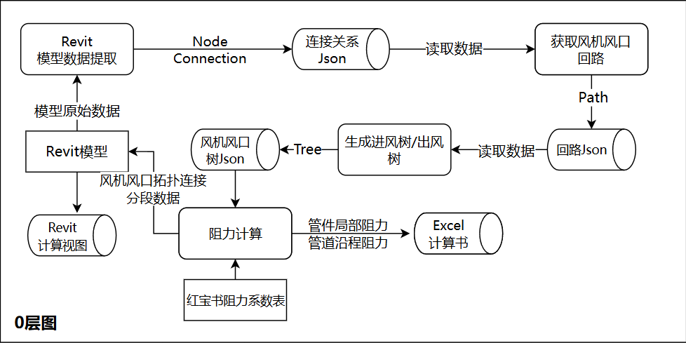
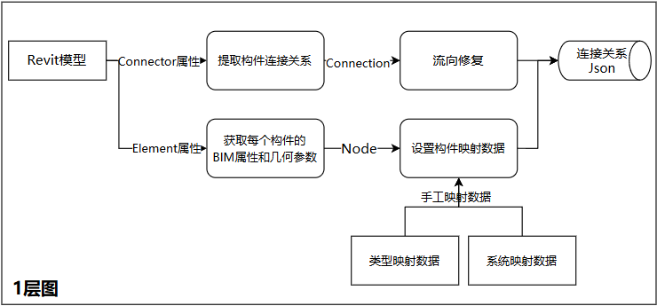
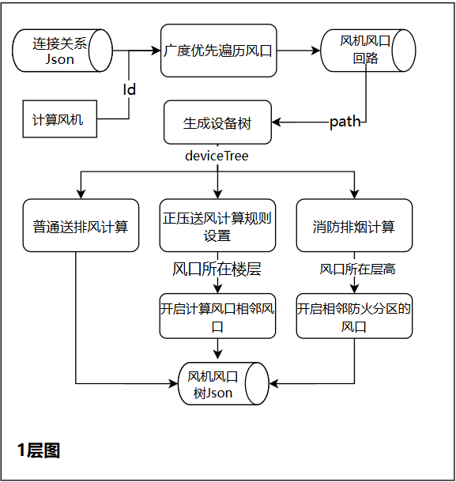
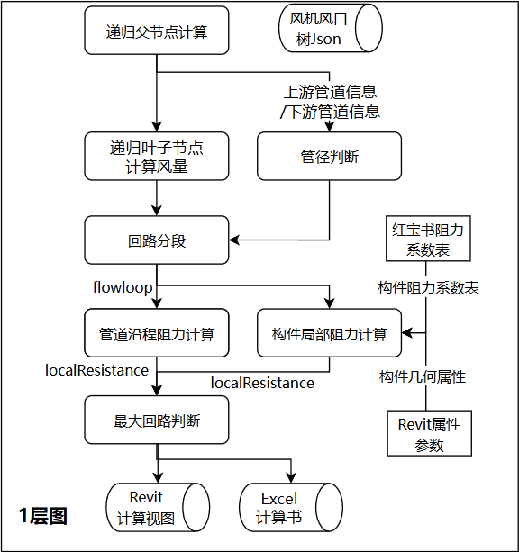
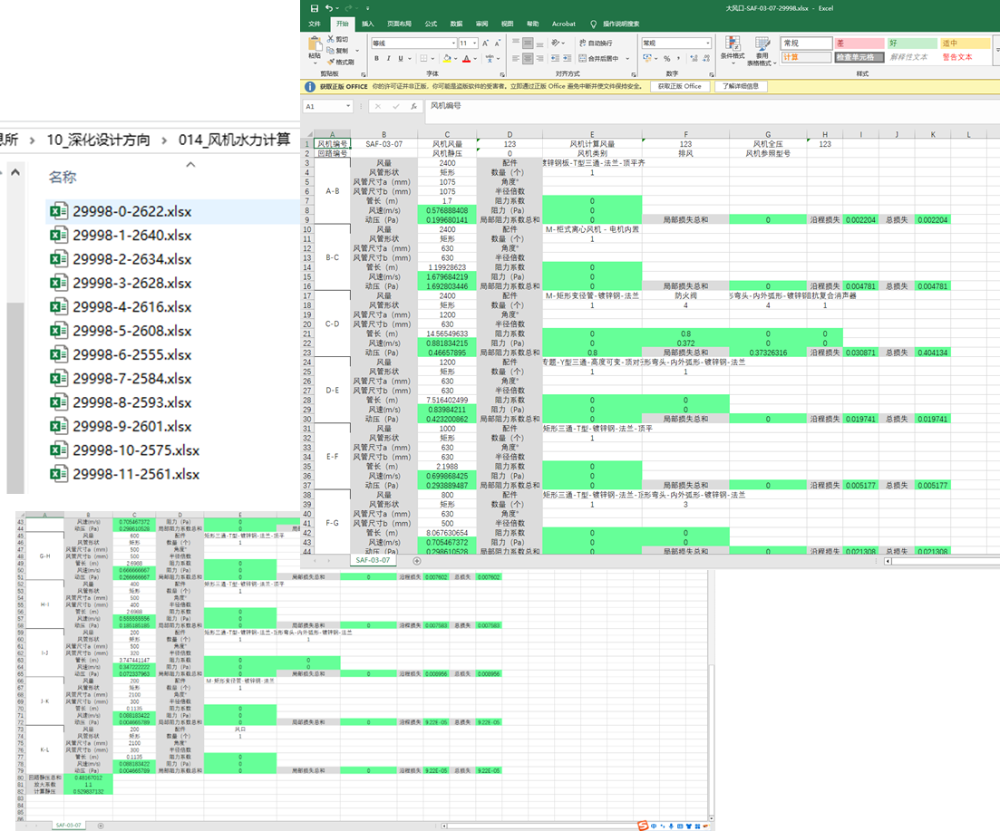

## 前言

这个工具最初来自集团安装公司的业务需求，主要服务于机电深化设计中的风系统校核场景。由于我并不是机电专业出身，对具体设计规范没有做过特别深入的研究，所以这里更多是从软件实现和业务流程的角度，梳理一下这个工具要解决的问题。

在实际项目中，设计院通常会先给出系统图和相对粗略的设计图，明确机房位置、风机布置以及主管的大致走向。但更细节的内容，比如支管如何布置、弯头和三通放在哪里、管径如何调整等，往往需要由机电深化设计继续完成。

不过，机电深化并不是自由画管线。深化完成后，还需要对整套风管系统进行阻力计算，校核结果必须满足风机选型和设计风量的要求。换句话说，只有当这套管网在当前风机型号下，能够保证各个风口达到设计风量，深化方案才算真正可用。

这个工具要解决的，就是把原本依赖人工拆路径、查表和汇总的阻力计算过程自动化，减少重复劳动和计算误差，让深化设计人员可以更快判断当前管网方案是否合理。

传统人工核算时，通常会先依靠经验选出一条“看起来最不利”的路径，再对照深化完成的 Revit 模型或导出的 CAD 图纸，沿着风管一段一段地统计参数并计算阻力。稍微自动化一些的做法，是由工程师自己编写 Excel VBA 脚本，把查表和公式计算放到表格里完成，但风量、管径、长度、弯头、三通等关键参数仍然需要人工从图纸中读取并录入。整体来看，这类流程只是把“计算”部分半自动化了，路径识别、参数提取和结果校核仍然高度依赖人工经验。

#### 计算方法

从风管设计的基本流程来看，首先要根据生产工艺和建筑空间对通风空调系统的要求，确定风管系统的形式、走向、空间位置、风口布置以及风管断面尺寸。对于公共建筑来说，风管高度和走向往往还会受到吊顶空间、梁高、其他机电管线综合排布等因素限制。

在深化设计阶段，管线布置完成后还需要计算风管系统的压力损失。图片里的核心公式可以概括为：

<div style="text-align:center;margin:1rem 0;">
$$
\Delta P = \Delta P_m + \Delta P_j 
$$
</div>

其中，$\Delta P$ 表示风管系统的总压力损失，$\Delta P_m$ 表示沿程压力损失，$\Delta P_j$ 表示局部压力损失。沿程压力损失主要来自空气在直管段中流动时与管壁产生的摩擦；局部压力损失则来自弯头、三通、变径、阀门、风口等构件导致的气流方向或截面变化。

##### 沿程压力损失计算

先看沿程压力损失 $\Delta P_m$。它只和风管直管段有关，计算时需要先确定每一段风管的风量、管径或截面尺寸、管内风速以及风管长度。对于圆形风管，风量可以按下式计算：

$$
L = 900\pi d^2 V
$$

对于矩形风管，风量可以按下式计算：

$$
L = 3600abV
$$

其中，$L$ 表示风量，单位为 $\mathrm{m^3/h}$；$d$ 表示圆形风管内径，单位为 $\mathrm{m}$；$a$、$b$ 分别表示矩形风管截面的净宽和净高，单位为 $\mathrm{m}$；$V$ 表示管内风速，单位为 $\mathrm{m/s}$。

**难点 1：下游风量统计**

手工计算时，第一个难点就是确定每一段风管承担的风量。某一段管道的风量并不是单独给定的，而是由它下游所有风口的设计风量累加得到。以往核算时，通常是在 Revit 中完成深化建模后，再导出 CAD 图纸，由人工顺着图纸一段管、一段管地追踪下游风口并手动汇总。这种方式不仅效率低，而且很容易在分支较多、管线交错复杂的系统中漏算或重复计算。

得到风量和风速后，单段直管的沿程压力损失可以写成：

$$
\Delta P_m = \Delta p_m l
$$

其中，$\Delta p_m$ 表示单位管长沿程摩擦阻力，单位为 $\mathrm{Pa/m}$；$l$ 表示该段风管长度，单位为 $\mathrm{m}$。单位管长摩擦阻力继续按下式计算：

$$
\Delta p_m = \frac{\lambda}{d_e}\frac{V^2}{2}\rho
$$

其中，$\lambda$ 表示摩擦阻力系数，$\rho$ 表示空气密度，$d_e$ 表示风管当量直径。

摩擦阻力系数 $\lambda$ 和风管内壁粗糙度、当量直径以及气流状态有关，可按下式计算：

$$
\frac{1}{\sqrt{\lambda}} = -2\log\left(\frac{K}{3.71d_e} + \frac{2.51}{Re\sqrt{\lambda}}\right)
$$

其中，$K$ 表示风管内壁的绝对粗糙度，单位为 $\mathrm{m}$；$Re$ 表示雷诺数。雷诺数用于判断气流的流动状态，计算公式为：

$$
Re = \frac{Vd_e}{\nu}
$$

其中，$\nu$ 表示空气运动黏度，单位为 $\mathrm{m^2/s}$。需要注意的是，$\lambda$ 同时出现在公式左右两侧，所以它不是代入一次就能直接得到的参数，程序里一般会给一个初始值，然后通过迭代计算到结果收敛。

对程序来说，每一段直管只要能拿到长度、截面尺寸和风量，就可以推算风速、当量直径、雷诺数和摩擦阻力系数，进而计算出该段的 $\Delta P_m$；一条路径上的沿程阻力就是这些直管段沿程损失的累加。

##### 局部压力损失计算

再看局部压力损失 $\Delta P_j$。当气流经过弯头、三通、变径、阀门、风口等构件时，流动方向、流通截面或流量分配会发生变化，气流会产生额外的能量损失，这部分就称为局部压力损失。其计算公式为：

$$
\Delta P_j = \zeta \frac{V^2}{2}\rho
$$

其中，$\zeta$ 表示局部阻力系数；$V$ 表示局部压力损失发生处的空气流速，单位为 $\mathrm{m/s}$；$\rho$ 表示空气密度，单位为 $\mathrm{kg/m^3}$。

局部阻力系数 $\zeta$ 一般不是通过统一公式直接算出来的，而是根据构件类型和几何参数查表或按规范取值。例如弯头会受到转弯角度、曲率半径和截面形状影响；三通会受到主管、支管风量分配比例和夹角影响；阀门则和阀门类型、开度有关。因此在程序里，需要先识别当前路径经过了哪些局部构件，再根据构件类型匹配对应的 $\zeta$，最后按该构件所在位置的风速计算 $\Delta P_j$。

$\zeta$ 就是查询红宝书，即 **《实用供热空调设计手册第二版(上册)》**,里面有各种构件，三通，天圆地方啥的实验室数据，各种表格，根据具体工况，查询对应构件的阻力系数，表格的系数也是各种各样，这也是其中一个难点，因为不同构件查询所需要的参数各不相同，查询也是个问题。

一条风路上的局部阻力，就是这条路径上所有局部构件压力损失的累加。它和沿程阻力不同：沿程阻力主要跟“管段长度”相关，而局部阻力主要跟“构件类型”和“气流状态变化”相关。

所以这个工具的计算思路并不是单独计算某一段风管，而是先把整套风系统抽象成一张管网：直管段负责提供长度、截面、风量等沿程阻力参数，弯头、三通、阀门等节点负责提供局部阻力参数。程序再根据风机到各个风口的路径，自动识别每条支路需要经过哪些管段和构件，分别计算并汇总 $\Delta P_m$ 和 $\Delta P_j$。

最终得到的结果可以用来判断当前深化方案是否满足风机选型要求：如果某条路径阻力过大，就说明该支路可能需要调整管径、优化走向、减少局部构件，或者重新复核风机余压。也就是说，软件做的事情本质上是把人工“拆路径、查参数、算阻力、汇总校核”的过程自动化。

<a href="http://kns--cnki--net--https.cnki.mdjsf.utuvpn.utuedu.com:9000/kcms2/article/abstract?v=x5ZT7qxuO_oQIYhXvPth45uv-LM75tQaf-98bhxrpVSsEF8AEFO2KsROPslXXE7OQR24Csr6j5_TwakHZEEDd6kDFbxEUaCiWBWLfh-Yc7oeVElKVL5Pt8paD5xHB_AeOapZ-QHuvbPGEg0gIBkIivbR1BEAJPb0ghIXaPEVkwg=&uniplatform=NZKPT" target="_blank" rel="noopener" style="color:#2563eb;font-weight:700">论文链接</a>


## 产品设计

这个产品的设计，可以说没有设计，至少部门里面没有配专门的产品跟进，算是开发也就是我自己调研需求，自己设计产品，那我也算是真全栈了哈哈哈哈哈，

#### Revit插件

这个产品一共做过两代。第一代采用 Revit 插件的形式，目标是让深化设计人员在模型完成后直接在 Revit 内完成阻力计算，也就是“深化即计算”，不再需要先导出 CAD 图纸，再回到二维图纸里人工拆路径和统计参数。

插件界面基于 WinForm 开发，主要承担前期数据配置和结果查看工作，包括构件类别匹配、系统类型匹配、固定阻力系数维护、固定阻力值配置等。计算时，插件直接读取 Revit 模型中的风管、风口、阀门、弯头、三通等构件信息，再根据系统连接关系组织管网拓扑，完成路径识别和阻力汇总。

这一版的优势是和建模环境结合紧密，工程师不需要离开 Revit 就能完成校核；不足也比较明显，部署、升级和数据共享都依赖单机插件，后续项目管理和多人协作能力会受到限制。


#### Web产品设计

第二代产品保留了第一代 Revit 插件中的核心计算算法，但对应用层进行了完整重构。后端改为基于 .NET Core 提供计算服务和数据接口，前端使用 Vue2 重新实现项目管理、参数配置、计算结果展示和报表查看等功能，整体从原来的 C/S 架构转向 B/S 架构。

这样调整主要有两个原因：一方面，Web 端更适合做结果共享和多人协作，工程师不需要都安装插件，只要通过浏览器就能查看计算结果、复核关键路径和导出报告；另一方面，服务端化之后也更方便做权限控制、项目归档、版本管理和后续商业化收费。

从产品形态上看，第一代更像是嵌在 Revit 里的专业计算工具，强调“建模完成后就地计算”；第二代则更偏向平台化，把计算能力从单机插件中抽出来，变成可部署、可管理、可复用的 Web 服务。


## 架构设计

### Revit插件



<div style="display:flex; gap:0px; align-items:flex-start;">
  
  
</div>

---

项目通过 `IExternalApplication` 接口在 Revit 功能区注册了 8 个命令按钮：

```csharp
application.CreateRibbonTab("管道阻力计算");
_panel = application.CreateRibbonPanel("管道阻力计算", "管道阻力计算");
CreatePushButton("MatchElement", "匹配族", "match");
CreatePushButton("GetConnection", "获取连接(单模型)", "connect");
CreatePushButton("GetLoopResult", "获取回路", "loop");
CreatePushButton("ExportExcel", "导出计算书", "Excel");
```

核心工作流为：**获取连接 → 匹配族类型 → 划分回路 → 水力计算 → 导出 Excel**。

#### 拓扑关系建模

##### 图数据模型

拓扑建模的第一步，是把 Revit MEP 模型中的连接关系转换成程序可以遍历的图结构。这里以 Connector 为基础，将管件、风口、风机等构件抽象为节点 `ElementConnectionNode`，将风管抽象为边 `ElementConnection`，最终构造一张无向图。

```csharp
public class ElementConnection : IEdge<ElementConnectionNode>
{
    public string Guid { get; set; }          // 管道唯一标识
    public double Width { get; set; }          // 矩形风管宽度
    public double Height { get; set; }         // 矩形风管高度
    public double Length { get; set; }         // 管段长度
    public ElementConnectionNode Source { get; set; }
    public ElementConnectionNode Target { get; set; }
}
```

在这个结构里，`Source` 和 `Target` 表示风管两端连接的构件节点，`Width`、`Height`、`Length` 则保留后续阻力计算需要用到的基础参数。

##### DFS 路径搜索

图结构建立完成后，就可以利用 `GraphFunc.FindPathsFromNode` 从风机节点出发，通过 DFS 遍历所有可能的风路，直到到达每个风口末端。每一条搜索结果都对应一条从风机到风口的计算路径。

```csharp
private static void DFS(UndirectedGraph<ElementConnectionNode, ElementConnection> graph,
    ElementConnectionNode currentNode, ...)
{
    if (currentNode.Category == "风道末端" || currentNode.Type == "风口")
        nodes.Add(new List<ElementConnectionNode>(currentPath));

    foreach (var edge in graph.AdjacentEdges(currentNode))
    {
        var neighbor = edge.Source.Guid == currentNode.Guid ? edge.Target : edge.Source;
        DFS(graph, neighbor, visited, ...);
    }
}
```

这样处理之后，原本需要人工在图纸上追踪的风管路径，就被转换成了图上的路径搜索问题。后续风量汇总、最不利路径判断和阻力累加，都可以基于这些路径结果继续计算。

---

#### 设备树与回路划分

##### 从路径构建设备树

DFS 得到的是一组从风机到风口的路径集合，但计算时还需要知道这些路径之间的共享关系、父子关系以及分支位置。因此，程序会通过 `GenerateTree.GetTree` 将所有路径合并成一棵以风机为根节点的设备树 `DeviceTree`。

设备树中的每个节点使用 `ElementNode` 表示，节点中会记录当前构件的父子关系、连接风管、风量、族映射名称等信息。这样做的目的，是把“多条路径”进一步整理成“一个完整系统”，方便后续识别主管、支管、分支点和回路分段。

```csharp
rootNode = new ElementNode()
{
    IsRoot = true,
    ChildrenNodeIds = new List<string>(),
    PipelineIds = new List<string>(),
    NodeId = firstNode.Guid,
    FamilyMappingName = firstNode.Type ?? firstNode.FamilyName,
};
```

##### 回路分段规则

设备树建立后，`GenerateLoop.GetOnePathLoop` 会沿着设备树自下而上遍历，并根据规则自动拆分计算回路。回路拆分的核心目的，是把一条完整风路切成若干段计算单元，让每一段都具备相对稳定的管径、风量和阻力计算条件。

当前主要有三类分段规则：

- **管径变化**：当风管宽度或高度发生变化时，需要拆分为新的计算段。
- **多分支**：当路径上出现多个下游分支时，需要在分支位置拆分。
- **风口数量变化**：当下游风口数量发生变化时，对应风量也会变化，需要重新划分回路。

```csharp
List<ISplitLoopInterface> splitLoopRules = new List<ISplitLoopInterface>
{
    new DiameterChange(),
    new MultipleLinks(),
    new OutletNumberChange()
};
```

通过这种方式，程序不再依赖人工判断“这一段算到哪里为止”，而是把回路划分规则显式写成策略类。后续如果要增加新的分段依据，也可以继续扩展新的 `ISplitLoopInterface` 实现。

---

#### 水力计算核心

##### 公式封装

水力计算相关公式统一封装在 `Formula` 类中。这样做的好处是计算过程不会散落在业务流程里，后续如果需要调整公式、替换参数来源或修正规范取值，只需要集中维护公式层。

矩形风管的当量直径计算如下：

```csharp
public static double GetDiameter(double width, double height)
    => 2 * width * height / (width + height);
```

雷诺数计算如下：

```csharp
public static double GetRenoCoefficient(double diameter, double flowVelocity)
    => (diameter / 1000) * flowVelocity / (15.06 * Math.Pow(10, -6));
```

沿程摩阻系数 $\lambda$ 使用 Colebrook 公式求解。由于公式中 $\lambda$ 同时出现在等式两侧，程序里采用迭代方式计算，直到结果收敛：

```csharp
public static double GetResisCoefficient(double K, double Re, double de)
{
    double relativeRoughness = K / de;
    double f = 1.0 / Math.Pow(-2 * Math.Log10(relativeRoughness / 3.71 + 6.9 / Re), 2);

    for (int i = 0; i < maxIterations; i++)
    {
        double sqrtF = Math.Sqrt(f);
        double g = 1.0 / sqrtF + 2 * Math.Log10(term1 + term2);
        double df = -g / dgdf;
        f += df;
        if (Math.Abs(df) < tolerance) break;
    }

    return f;
}
```

动压、局部损失和沿程损失则进一步组合成单个回路的阻力结果：

```csharp
public static double GetDynamicPressure(double density, double flowVelocity)
    => density * Math.Pow(flowVelocity, 2) * 0.5;

public static double GetLocalLoss(double dynamicPressure, List<ElementNode> nodes)
    => dynamicPressure * resistanceCoefficient + localLoss;

public static double GetRunLoss(double length, double unitSpecificFriction)
    => length * unitSpecificFriction;
```

##### 回路计算流程

`FlowLoopCal.Import` 负责对单个回路完成完整计算。它会依次计算当量直径、雷诺数、动压、单位比摩阻、局部损失和沿程损失，最后汇总为该回路的总阻力。

```csharp
var reno = Formula.GetRenoCoefficient(equivalentDiameter, flowVelocity);
var dynamicPressure = Formula.GetDynamicPressure(density, flowVelocity);
var unitSpecificFriction = Formula.GetUnitSpecificFriction_lambda(
    FlowVelocity,
    diameter,
    pipeRoughness,
    Reno,
    1.2
);
var localLoss = Formula.GetLocalLoss(dynamicPressure, entity.Nodes);
var runLoss = Formula.GetRunLoss(length, unitSpecificFriction);
this.TotalLoss = localLoss + runLoss;
```

到这一层时，前面的拓扑分析已经把“应该算哪条路径、路径上有哪些管段和构件”整理好了，计算层只需要面向标准化后的回路对象执行公式即可。

---

#### 管件阻力系数查表

##### 查表策略模式

局部阻力系数的难点在于不同构件的查表条件并不统一。弯头、三通、变径管、消声器、天圆地方等构件对应的参数维度不同，有的要看宽高比，有的要看曲率半径，有的要看风量分配比例。

因此程序通过 `GetNodeFricTable` 工厂类，将族映射名称路由到不同的查表实现。每一种构件只负责自己的参数提取和查表逻辑，主流程只需要按构件类型调用即可。

```csharp
_nodeTable = new Dictionary<string, IPipeNode>
{
    {"弯头", new Elbow()},
    {"三通", new ThreeLink()},
    {"矩形变径管", new RectangularReducer()},
    {"消声器", new Muffler()},
    {"天圆地方", new CircularToRectangularTransitionPipe()},
    ...
};
```

##### 弯头查表示例

以 `Elbow` 为例，程序会先从 Revit 构件参数中提取尺寸信息，再根据宽高比、曲率半径比等参数查询对应表格。如果查询点落在表格两个取值之间，则通过插值得到更接近实际工况的阻力系数。

```csharp
public override double GetTableValue(string deviceGuid, DeviceTree deviceTree, PathResult flowPath, int index)
{
    var radiusModifyValue = GetRadiusModifyValue(deviceTree, flowPath, index);
    var transverseAxisValue = GetTransverseAxis(...);
    var longitudinalAxisValue = GetLongitudinalAxis(...);
    var value = InterpolationQuery.GetTwoDimensionsValue(
        longitudinalAxisValue,
        transverseAxisValue,
        _tableDic
    );

    return Math.Round(radiusModifyValue * value, 2);
}
```

##### 插值算法

查表数据并不一定覆盖所有实际参数，因此 `InterpolationQuery` 实现了一维线性插值和二维双线性插值。二维表格查询时，会先在两个相邻行上分别做一维插值，再根据纵向比例做一次线性插值。

```csharp
public static double GetTwoDimensionsValue(
    double y,
    double x,
    Dictionary<double, Dictionary<double, double>> tableDic
)
{
    var value1 = GetSingleLineValue(x, tableDic[y_low]);
    var value2 = GetSingleLineValue(x, tableDic[y_high]);
    var proportion = (y - y_low) / (y_high - y_low);

    return value1 + (value2 - value1) * proportion;
}
```

这个设计把“不同构件怎么查表”和“表格中间值怎么插值”拆开处理，既能减少重复代码，也方便后续补充新的构件类型。

---

#### 结果导出

计算完成后，结果需要形成工程师可以复核和归档的计算书。第一代插件中使用 NPOI 生成 Excel 文件，`ExportToExcel.ExportNew` 负责整体导出流程，`ComputingUnit` 负责单个回路的单元格排版和样式控制。

```csharp
CreateCellWithStyle("风量", row1, 1, _greyStyle);
CreateCellWithStyle(loop.FlowRate, row1, 2, _centerStyle);
CreateCellWithStyle("风速(m/s)", row6, 1, _greyStyle);
CreateCellWithStyle(loop.FlowVelocity, row6, 2, _greenStyle);
CreateCellWithStyle("总损失", row7, 9, _greyStyle);
CreateCellWithStyle(loop.TotalLoss, row7, 10, _greenStyle);
```

最终导出的计算书会汇总各个回路的静压结果，并按默认放大系数进行修正。这样既保留了自动计算的效率，也方便设计人员按传统计算书格式进行复核。

结果计算书如下：

---

#### 架构小结
PipelineFlow 的 Revit 插件部分可以拆成四层：

- **拓扑层**：负责从 Revit Connector 构建图结构，并通过 DFS 搜索风机到风口的路径，核心类包括 `GraphFunc`、`ElementConnection`。
- **建模层**：负责把路径集合整理成设备树，并根据规则拆分计算回路，核心对象包括 `DeviceTree`、`GenerateLoop` 和各类分段规则。
- **计算层**：负责水力学公式、沿程阻力、局部阻力、查表和插值，核心类包括 `Formula`、`FlowLoopCal`、`GetNodeFricTable`。
- **输出层**：负责将计算结果导出为 Excel 计算书，核心类包括 `ExportToExcel`、`ComputingUnit`。

这个架构的核心价值，是把原本依赖人工经验的风管核算流程拆成可编程的几个步骤：从模型读取连接关系，用图算法识别路径，再用规则划分回路，最后自动完成公式计算、查表插值和结果导出。它真正解决的并不是某一个公式的计算问题，而是从 Revit 模型到阻力计算书的端到端自动化。

> 项目使用的主要依赖包括：Revit API、QuikGraph、NPOI、MathNet.Numerics 和 Newtonsoft.Json。

### Web架构的计算工具
Web 端不是把 Revit 插件简单搬到浏览器里，而是把原本一次性的本地计算流程拆成了平台化的服务流程。图算法、设备树生成、回路划分和阻力计算这些核心算法与插件端基本一致，这里只一笔带过；重点看 Web 端新增的用户入口、模型数据入库、异步任务调度、结果持久化和外部服务集成。

#### Web端整体分层

项目是前后端同仓结构：后端是 ASP.NET Core 6 服务 `IBuildingCloud.PipelineFlow`，前端是 Vue 2 + TypeScript 应用 `ibuildingcloud-pipelineflow-app`。后端启动时会把前端路径、外部服务客户端、Redis、用户上下文和一组后台任务注册到容器中。

```csharp
BaseUrl = "pipelineflow";
VuePath = "../ibuildingcloud-pipelineflow-app";

services.AddSingleton(new ModelTaskClient(
    Configuration.GetValue<string>("MODELTASK_URL"),
    new HttpClient()
));

services.AddScoped<IRedisCacheService, RedisCacheService>();
services.AddScoped<IUserContext, UserContext>();

services.AddHostedService<ModelDataExtractService>();
services.AddHostedService<ModelDataStoreService>();
services.AddHostedService<BimfaceTranslateService>();
services.AddHostedService<InitTableValue>();
services.AddHostedService<CalculateNodePath>();
services.AddHostedService<CalculateLoopService>();
```

这段注册基本能看出 Web 端的主干：`ModelTaskClient` 负责调用外部模型任务服务，`RedisCacheService` 负责缓存参数表，`BimfaceTranslateService`、`ModelDataExtractService`、`ModelDataStoreService` 负责把模型文件变成可计算数据，`CalculateNodePath` 和 `CalculateLoopService` 负责后续计算。

从架构上可以拆成五层：

- **前端交互层**：负责项目入口、Task 创建、模型上传、模型查看、映射配置、连接修复、计算触发和计算书展示。
- **接口服务层**：通过 Controller 暴露任务、模型、路径、回路、计算书、参数表等 API，并复用平台 Auth 做项目权限校验。
- **模型数据层**：把上传的 Revit 模型交给 BIMFACE 和 ModelTask 服务处理，再把提取出的连接点、连接关系、构件族、楼层等数据写入 MongoDB。
- **计算调度层**：通过后台服务轮询任务状态，把路径搜索和阻力计算拆成可并发、可追踪的异步任务。
- **存储与缓存层**：关系型数据库保存任务和文件等结构化数据，MongoDB 保存模型拓扑和计算结果，Redis 缓存高频参数表。

---

#### 前端任务入口

插件端是“打开 Revit 模型后直接计算”，Web 端则先引入“项目”和“Task 计算任务”的概念。用户在前端创建 Task，同时上传一个或多个模型文件；前端提交完成后，后端先创建计算任务，再把文件地址提交到模型文件接口。

```typescript
let taskInputModel = new CalculateTaskInputModel({
  name: this.formData.name,
  description: this.formData.description,
  createdTime: new Date().toISOString(),
});
let taskId = await api.CalculateTaskService.postCalculateTasks({
  projectId: this.projectId,
  body: taskInputModel,
});

let modelUploadInputModel = new ModelUploadInputModel({
  taskId: taskId,
  files: this.formData.fileUrls,
});
await api.ModelFileService.postModelfiles({
  projectId: this.projectId,
  taskId: taskId.toString(),
  body: modelUploadInputModel,
});
```

前端路由也围绕这个业务关系展开。后台页路径中同时带有 `projectId` 和 `taskId`，同一个 Task 下再挂模型管理、标高管理、模型映射、连接修复、计算书和参数表等功能页面。

```typescript
path: "/backstage/projects/:projectId/tasks/:taskId",
children: [
  { path: "models", component: () => import("../views/settings/ModelView.vue") },
  { path: "floors", component: () => import("../views/settings/FloorSettings.vue") },
  { path: "modelDataMatch", component: () => import("../views/settings/ModelDataMatch.vue") },
  { path: "modelFix", component: () => import("../views/settings/ModelFix.vue") },
  { path: "calculatebook", component: () => import("../views/settings/CalculateBook.vue") },
  { path: "nodeTableSettings", component: () => import("../views/settings/NodeTableSettings.vue") },
]
```

这样 Web 端的计算对象就不再是一次性的本地文件，而是一个可以被用户管理、持续更新和后续复核的 Task。

---

#### 用户与任务接口

后端任务接口以项目为边界，接口路径中带 `projectId`，并通过 `ValidateToken(projectId)` 校验用户在项目中的访问权限。创建任务时会把当前用户写入输入模型，查询任务时也会按用户维度过滤。

```csharp
[ApiController]
[Authorize]
[Route("api/pipelineflow/projects/{projectId}/calculateTasks")]
public class CalculateTaskController : ControllerBase
{
    [HttpGet]
    public async Task<List<CalculateTaskViewModel>> GetCalculateTasks(int projectId, ...)
    {
        var token = this.ValidateToken(projectId);
        var userId = token.Id;
        return await _calculateTaskService.GetCalculateTasks(projectId, userId, ...);
    }

    [HttpPost]
    public async Task<int> Post(int projectId, [FromBody] CalculateTaskInputModel value)
    {
        var token = this.ValidateToken(projectId);
        value.UserId = token.Id;
        return await _calculateTaskService.Add(projectId, value);
    }
}
```

`CalculateTask` 是用户创建的计算任务，`CalDeviceTask` 则是某个 Task 下按风机拆出来的设备计算任务。这个拆分很重要：一个项目可以有多个计算任务，一个计算任务可以上传多个模型，而真正执行路径和阻力计算时，是按风机设备粒度并发处理的。

```csharp
public class CalculateTask : IEntity
{
    public string TaskName { get; set; }
    public int UserProjectId { get; set; }
    public CalculateStatus Status { get; set; }
    public bool HasConnectoinFixed { get; set; }
    public string Guid { get; set; }
    public int ProjectId { get; set; }
}

public class CalDeviceTask : IEntity
{
    public int TaskId { get; set; }
    public string DeviceGuid { get; set; }
    public int DeviceElementId { get; set; }
    public CalculateRules CalculateRules { get; set; }
    public CalculateDeviceStatus Status { get; set; }
}
```

这一层解决的是插件端没有处理的问题：计算结果属于哪个用户、哪个项目、哪个计算任务，后续如何重新计算、查看、删除和共享。

---

#### 模型数据入库

Web 端上传模型后，不直接在请求里完成解析，而是通过后台服务推进模型处理状态。`BimfaceTranslateService` 负责查询 BIMFACE 上传状态、发起转换并写回缩略图；`ModelDataExtractService` 负责向 ModelTask 服务提交“模型风阻回路提取”任务；`ModelDataStoreService` 在提取完成后，把 OSS 上的 JSON 数据导入 MongoDB。

```csharp
var filesToTranslate = await modelFiles.GetMany(0, x =>
    (x.State & ModelStatus.上传到BIMFACE完成) > 0 &&
    (x.State & ModelStatus.开始BIMFACE模型转换) == 0 &&
    (x.State & ModelStatus.BIMFACE模型转换完成) == 0);

foreach (var file in filesToTranslate)
{
    await bimFace.TranslateFile(file.Web3dUrl, file.Guid, file.UseBimTile);
    await modelFiles.UpdateStatus(file.Id, ModelStatus.开始BIMFACE模型转换, true, "开始BIMFACE模型转换");
}
```

```csharp
await modelTasks.PostOrdertasksAsync(
    new OrderTaskInfoInputModel
    {
        Guid = file.Guid,
        OrderExeName = "模型风阻回路提取",
        TaskName = "ConnectExtract" + file.Name,
        RvtAddress = file.SourceUrl
    });
await modelFiles.UpdateStatus(file.Id, ModelStatus.开始模型数据提取, true, "开始模型数据提取");
```

数据真正入库的逻辑在 `ModelDataService.Import`。它从 OSS 读取 ModelTask 生成的 JSON，并把楼层、连接点、连接关系、Connector、构件族等信息补上 `ModelFileId`、`ProjectId` 和 `TaskId` 后写入 MongoDB。

```csharp
var elementConnectionNodes = await GetJson<ElementConnectionNode>(modelGuid, "PipeConnectionNode");
elementConnectionNodes.ForEach(n =>
{
    n.ModelFileId = modelId;
    n.ProjectId = projectId;
    n.TaskId = taskId;
    n.PositionX = n.Position[0];
    n.PositionY = n.Position[1];
    n.PositionZ = n.Position[2];
});
await nodeRepo.AddRange(elementConnectionNodes);

var elementConnections = await GetJson<ElementConnection>(modelGuid, "PipeConnection");
elementConnections.ForEach(c =>
{
    c.ModelFileId = modelId;
    c.ProjectId = projectId;
    c.TaskId = taskId;
});
await connectionRepo.AddRange(elementConnections);
```

这一步相当于把 Revit 插件里“从模型直接读 Connector”的过程，改造成了 Web 服务中的“模型文件 -> 外部提取任务 -> JSON -> MongoDB 拓扑数据”。

---

#### 设备任务生成

模型拓扑数据入库后，系统需要找到哪些设备需要计算。`CalculateDeviceTaskService.GeneratePathTask` 会先检查当前启用模型组合是否发生变化，如果变化就重新修复连接关系；然后通过族映射找出被标记为“风机”的构件，并为每台风机创建或更新一个 `CalDeviceTask`。

```csharp
var modelFiles = await _modelFileRepo.GetMany(x => x.TaskId == taskId && x.IsActivated);
var modelFileIds = modelFiles.Select(x => x.Id).ToList();
var taskModelFileGuid = Utils.Utils.GenerateGuid(modelFileIds);
if (!calculateTask.HasConnectoinFixed || calculateTask.Guid != taskModelFileGuid)
{
    await _repairConnectionService.RepairModelConnection(projectId, taskId);
    calculateTask.HasConnectoinFixed = true;
    calculateTask.Guid = taskModelFileGuid;
    await _calculateTaskRepo.Update(taskId, calculateTask);
}

var fanFamilyNames = elementFamilies
    .Where(x => x.MappingNodeName == "风机")
    ?.Select(x => x.FamilyName)
    .ToList() ?? new List<string>();

var deviceNodes = await _nodeRepo.GetMany(x =>
    x.ProjectId == projectId &&
    x.TaskId == taskId &&
    modelFileIds.Contains(x.ModelFileId) &&
    fanFamilyNames.Contains(x.FamilyName));
```

如果风机已经存在对应任务，就重置为“开始获取风机路径”；如果是新风机，就创建新的设备任务；如果模型中已经不存在这台风机，则删除旧任务。这个设计让 Web 端可以支持模型反复上传、启用/停用和重新计算，而不用每次都从零开始人工整理。

```csharp
if (calTaskDeviceGuids.Contains(deviceNode.Guid))
{
    var taskToUpdate = existCalDeviceTasks.First(x => x.DeviceGuid == deviceNode.Guid);
    taskToUpdate.Status = CalculateDeviceStatus.开始获取风机路径;
    taskToUpdate.StartTime = DateTime.Now;
    tasksToUpdate.Add(taskToUpdate);
    continue;
}

var calculateDeviceTask = new CalDeviceTask();
calculateDeviceTask.ProjectId = projectId;
calculateDeviceTask.TaskId = taskId;
calculateDeviceTask.DeviceGuid = deviceNode.Guid;
calculateDeviceTask.DeviceElementId = deviceNode.ElementId;
calculateDeviceTask.Status = CalculateDeviceStatus.开始获取风机路径;
calculateDeviceTasks.Add(calculateDeviceTask);
```

---

#### 路径计算与设备树

路径计算使用后台轮询模型。`CalculateNodePath` 定时扫描状态为“开始获取风机路径”的设备任务，批量读取当前 Task 下启用模型的连接点和连接关系，并按任务分组缓存到内存中，随后并发处理每个设备任务。

```csharp
pendingTasks = await taskRepo.GetMany(x =>
    (x.Status & CalculateDeviceStatus.开始获取风机路径) > 0 &&
    (x.Status & CalculateDeviceStatus.获取风机路径完成) == 0 &&
    (x.Status & CalculateDeviceStatus.正在进行获取风机路径) == 0 &&
    (x.Status & CalculateDeviceStatus.获取风机路径失败) == 0);

var modelFileIds = (await modelFileRepo.GetMany(x =>
    taskIds.Contains(x.TaskId) && x.IsActivated))
    .Select(x => x.Id)
    .ToList();

_elementConnectionNodes = (await nodeRepo.GetMany(x =>
    modelFileIds.Contains(x.ModelFileId)))
    .GroupBy(x => x.TaskId)
    .ToDictionary(x => x.Key, x => x.ToList());
```

真正生成路径和设备树时，Web 端复用了插件端的核心思路：输入是连接点和连接关系，输出是 `PathResult` 和 `DeviceTree`。不同的是，Web 端把结果写回 MongoDB，并通过任务状态把计算过程暴露给前端。

```csharp
await pathResultRepo.DeleteWhere(x =>
    x.ProjectId == deviceTask.ProjectId &&
    x.TaskId == deviceTask.TaskId &&
    x.DeviceGuid == deviceTask.DeviceGuid);

await deviceTreeRepo.DeleteWhere(x =>
    x.ProjectId == deviceTask.ProjectId &&
    x.TaskId == deviceTask.TaskId &&
    x.DeviceGuid == deviceTask.DeviceGuid);

await deviceTreeService.GenerateDeviceTree(deviceTask, elementConnectionNodes, elementConnections);

deviceTask.Status = CalculateDeviceStatus.获取风机路径完成;
await taskRepo.Update(deviceTask.Id, deviceTask);
```

这里的架构重点不是路径算法本身，而是把路径计算变成了可以失败重试、可以并发执行、可以按风机追踪状态的后台任务。

---

#### 阻力计算与结果保存

路径和设备树生成后，`CalculateLoopService` 会继续扫描“开始进行阻力计算”的设备任务。它从 MongoDB 中读取进风路径、出风路径、进风树、出风树，以及节点修正系数和阻力系数表，然后调用回路计算逻辑生成最终结果。

```csharp
pendingTasks = await taskRepo.GetMany(x =>
    (x.Status & CalculateDeviceStatus.开始进行阻力计算) > 0 &&
    (x.Status & CalculateDeviceStatus.获取风机路径失败) == 0);

var inPaths = await pathResultRepo.GetMany(x =>
    x.DeviceGuid == currentTask.DeviceGuid &&
    x.ProjectId == currentTask.ProjectId &&
    x.TaskId == currentTask.TaskId &&
    x.Direction == PathDirection.In);

var outPaths = await pathResultRepo.GetMany(x =>
    x.DeviceGuid == currentTask.DeviceGuid &&
    x.ProjectId == currentTask.ProjectId &&
    x.TaskId == currentTask.TaskId &&
    x.Direction == PathDirection.Out);
```

```csharp
var getCommonLoop = new GetCommonLoop(
    getNodeFricTable,
    flowLoopCalRepo,
    calDeviceTaskRepo,
    nodeFixedCoefficientRepo,
    airFlowPathService
);

getCommonLoop.inPath = inPaths;
getCommonLoop.outPath = outPaths;
getCommonLoop.deviceTreeIn = inTree;
getCommonLoop.deviceTreeOut = outTree;
getCommonLoop.CalDeviceTask = currentTask;

await getCommonLoop.GetLoop();
```

这部分和 Revit 插件中的计算层高度相似，仍然是围绕路径、设备树、节点阻力系数和回路对象进行计算。Web 端的差异在于：计算过程通过 `CalDeviceTask.Status` 持续推进，计算结果以文档形式保存，前端可以随时读取并展示计算书、路径结果和回路阻力。

---

#### 参数表缓存

插件端的参数表可以在本地单例中缓存，Web 端则把高频参数表放到 Redis。服务启动时，`InitTableValue` 从数据库读取节点参数表，并按管件名称写入 Redis Hash。

```csharp
var tables = await pipeNodeTableService.GetMany(0);
foreach (var table in tables)
{
    await redisCacheService.HashSetAsync("PipelineFlowTable", table.PipeNodeName, table);
}
```

阻力计算时再通过 `GetNodeFricTable` 根据构件映射名称选择具体查表策略。这一层的设计与插件端“管件类型 -> 查表类 -> 插值计算”的思路一致，只是数据来源从本地内存改成了服务端缓存。

```csharp
_nodeFactories = new Dictionary<string, Func<IPipeNode>>
{
    { "弯头", () => new Elbow(_getTableValueService, _connectorRepo) },
    { "矩形弯头", () => new VerticalElbow(_getTableValueService, _connectorRepo) },
    { "矩形变径管", () => new RectangularReducer(_getTableValueService, _connectorRepo) },
    { "天圆地方", () => new CircularToRectangularTransitionPipe(_getTableValueService, _connectorRepo) },
};
```

---

#### Web架构小结

PipelineFlow 的 Web 端可以拆成五层：

- **入口层**：Vue 前端负责 Task 创建、模型上传、模型管理、映射配置、连接修复、计算触发和结果展示，核心页面包括 `Desktop`、`BackStage`、`ModelView`、`ModelDataMatch`、`ModelFix`、`CalculateBook`。
- **接口层**：ASP.NET Core Controller 以 `projectId` 和 `taskId` 组织 API，核心接口包括 `CalculateTaskController`、`ModelFileController`、`CalDeviceTaskController`、`AirFlowPathController`、`FlowLoopCalController`。
- **模型数据层**：`BimfaceTranslateService`、`ModelDataExtractService`、`ModelDataStoreService` 把上传模型转换为可计算的 MongoDB 拓扑数据，核心数据包括 `ElementConnectionNode`、`ElementConnection`、`ElementConnector`、`ElementFamily`。
- **计算调度层**：`CalculateDeviceTaskService` 负责按风机生成设备任务，`CalculateNodePath` 负责路径和设备树，`CalculateLoopService` 负责回路和阻力计算。
- **存储缓存层**：关系型数据库保存任务、模型文件和楼层等管理数据，MongoDB 保存模型拓扑与计算结果，Redis 缓存红宝书参数表。

这个架构的核心价值，是把 Revit 插件中“本机模型读取 -> 即时计算 -> Excel 输出”的流程，改造成了“用户创建 Task -> 上传模型 -> 后台提取拓扑 -> 异步计算 -> Web 查看和归档”的平台流程。计算逻辑没有被推翻，但它被放进了一个更适合多人协作、结果追踪和服务化部署的系统里。


## 后话

行业内常用的“红宝书”仍以 2008 年版本为主，说是要出第二版也是没有后续了，其中不少数据来源于早期的实验室条件。再叠加现场施工质量、材料偏差和安装误差等因素，理论计算结果与实际测量结果之间难免会存在差异。

因此，这类计算工具的价值主要体现在两个方面：一是面对要求较高的业主时，可以快速出具相对规范的计算书；二是在现场风量不足、阻力偏大等问题出现时，工程团队可以用计算结果作为依据，推动业主或相关方调整风机选型。单从行业需求来看，它未必是一个特别强烈的刚需，但从程序开发的角度看，它是一次把工程经验、规范计算和 BIM 数据结合起来解决实际问题的数字化实践。至少这个项目代码是写爽了。